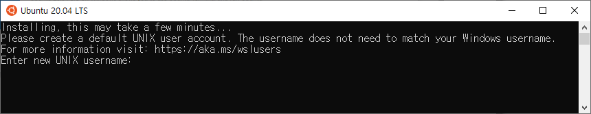

# WSL 설치하기
---
윈도우 운영체제에 windows subsystem linux 를 설치합니다. 

## 설치 가능한 리눅스 배포본 종류
초기의 WSL은 소수의 리눅스 배포본만을 설치 할 수 있었습니다. 
하지만, 시간이 지남으로써 더 많은 종류의 리눅스 배포본을 설치할 수 있습니다. 
설치 가능한 배포본의 목록은 다음과 같이 조회 할 수 있습니다.

```
wsl --list --online
```

다음은 온라인 스토어에 등록되어 있는 리북스 배포본의 종류입니다.

```
C:\Users\infoh>wsl --list --online
다음은 설치할 수 있는 유효한 배포판 목록입니다.
'wsl.exe --install <Distro>'를 사용하여 설치합니다.

NAME                                   FRIENDLY NAME
Ubuntu                                 Ubuntu
Debian                                 Debian GNU/Linux
kali-linux                             Kali Linux Rolling
Ubuntu-18.04                           Ubuntu 18.04 LTS
Ubuntu-20.04                           Ubuntu 20.04 LTS
Ubuntu-22.04                           Ubuntu 22.04 LTS
OracleLinux_8_5                        Oracle Linux 8.5
OracleLinux_7_9                        Oracle Linux 7.9
SUSE-Linux-Enterprise-Server-15-SP4    SUSE Linux Enterprise Server 15 SP4
openSUSE-Leap-15.4                     openSUSE Leap 15.4
openSUSE-Tumbleweed                    openSUSE Tumbleweed
```

## 배포본 설치하기
WSL은 리눅스를 설치하는 방법으로 온라인 스토어와 콘솔 명령을 제공합니다.

### 콘솔 명령으로 설치하기
WSL의 기본 배포본은 Ubuntu 입니다. 하지만, 설치 옵션에서 배포본을 지정하여 특정 리눅스를 설치할 수 있습니다.

```
wsl.exe --install <Distro>
```

### sotre에서 설치하기
wsl은 `windows store`를 통하여 설치할 수 있습니다. store에 접속하여 원하는 배포본을 검색합니다.
다음은 `ubuntu`를 검색하여 설치를 진행해 봅니다.
> 스토어에는 동일한 배포본도 버젼에 따라 여러개의 설치 항목들이 존재합니다.    


`시작` 버튼을 클릭하여 우분투를 설치합니다.  
잠시후 설치가 완료되면 우분투 시스템의 계정과 비밀번호를 입력하는 콘솔 창이 실행이 됩니다.  



우분투에서 요구하는 `사용자`명, `비밀번호`를 입력하면 다음과 같이 로그인을 합니다.


다음서 부터는 우분투 실행시 생성한 계정으로 `자동 접속`을 하게 됩니다. 


