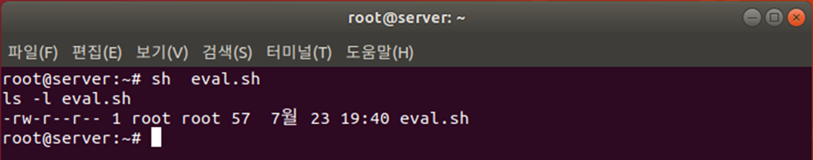

# eval
문자열을 명령문으로 인식하여 실행 합니다.

```bash
#!/bin/sh
str="ls -l eval.sh"
echo $str
eval $str
exit 0
``` 

* 3행: str 변수의 값인 ‘ls -l eval.sh’라는 글자를 그대로 출력

* 4행: str 변수의 값인 ‘ls -l eval.sh’를 명령으로 인식하여 실행


