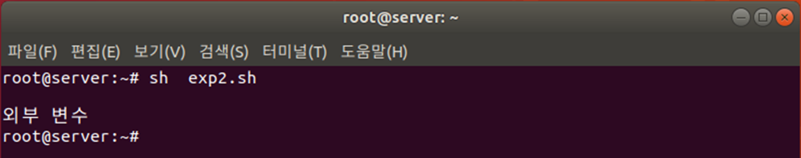

# export
특정 변수를 전역 변수로 만들어 모든 셸에서 사용

exp1.sh
```bash
#!/bin/sh
echo $var1
echo $var2
```
* exp1.sh 2~3행: var1, var2 변수를 출력


exp2.sh
```bash
#!/bin/sh
var1="지역변수"
export var2="전역변수"
sh exp1.sh
exit 0
```
* exp2.sh 2행: var1에 값을 넣고 일반 변수(지역 변수)이므로 현재 프로그램인 exp2.sh에서만 사용
* exp2.sh 3행: var2를 외부 변수로 선언하고 값을 넣음
* exp2.sh 4행: exp1.sh를 실행




