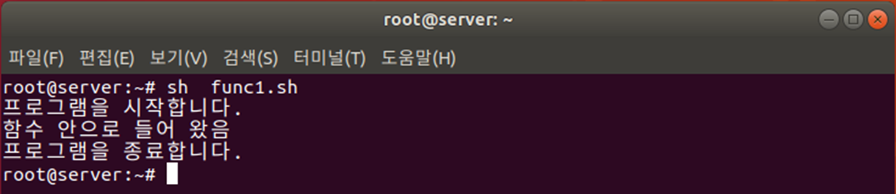
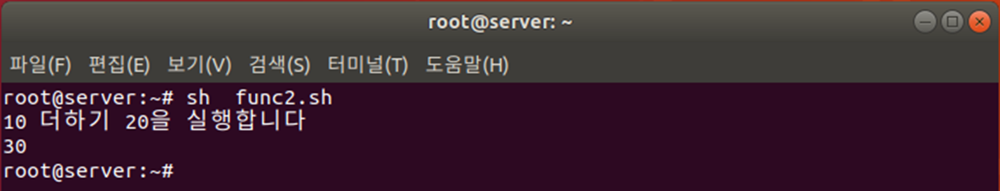

# 함수


## 사용자 정의 함수

사용자가 직접 함수를 작성하고 호출 합니다.


### 함수선언

```bash
함수명() {
	내용
}
```


## 함수호출

```bash
함수명 # 함수 호출
```


### 예제

func1.sh

```bash
#!/bin/sh
myFunction() {
	echo "함수 안으로 들어 왔음"
	return
}

echo "프로그램을 시작합니다."
myFunction
echo "프로그램을 종료합니다"

exit 0
```

* 2~5행: 함수 정의

* 6행: 여기서부터 프로그램이 시작

* 7행: 함수명을 사용하면 함수를 호출




### 함수의 파라미터 사용


```bash
함수명() {
	$1, $2, ... 등을 사용
}

# 함수 호출
함수명 파라미터1 파라미터2
```


### 예제

```bash
#!/bin/sh
hap() {
	echo `expr $1 + $2`
}

echo "10 더하기 20을 실행하기"
hap 10 20

exit 0
```


* 함수의 파라미터(인자)를 사용하려면 함수를 호출할 때 뒤에 파라미터를 붙임

* 함수 안에서는 $1, $2, …를 사용

* 3행: 넘겨받은 파라미터 $1과 $2를 더한 값을 출력

* 6행: 호출할 때 함수명에 넘겨줄 파라미터를 공백으로 분리하여 차례로 넣음





## shift
---
파라미터 변수를 왼쪽으로 한 단계씩 아래로 시프트(이동)


 

* 3행: 결과를 누적할 str 변수를 초기화

* 4행: $1 파라미터가 비어 있지 않은 동안 반복 실행

* 5행: str 변수에 $1을 추가

* 6행: 전체 파라미터를 왼쪽으로 시프트

* 8행: while문을 빠져나오면 누적한 str 변수를 출력


