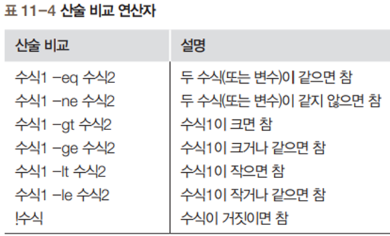
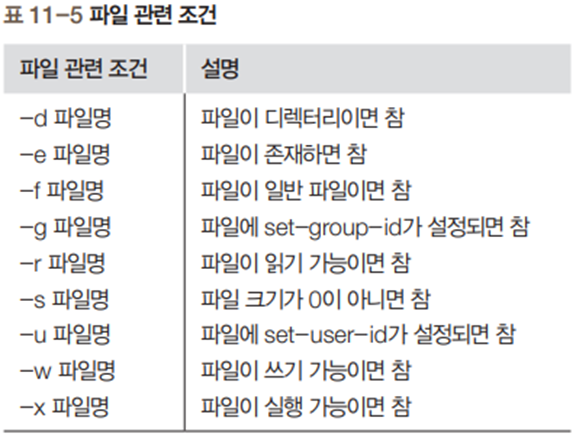
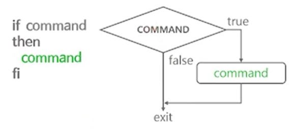
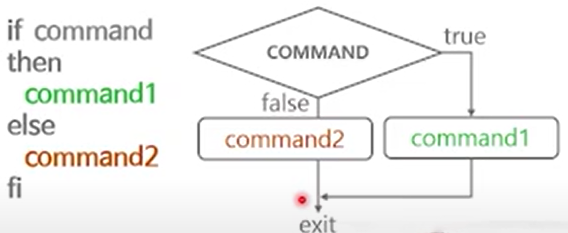
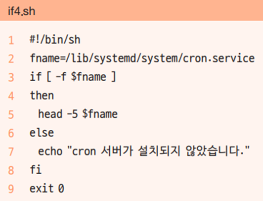
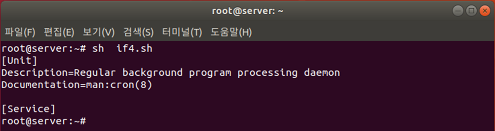
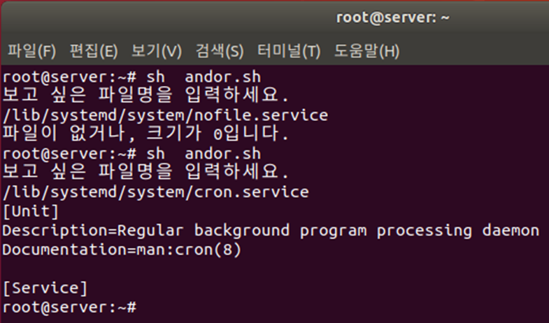

# 조건분기

## exit
---
모든 명령어는 실행된 후에 종료 코드를 발생한다. 이를 통하여 수행한 명령의 상태가 어떻게 되었는지 확인합니다.
종료 코드는 0~255 까지의 숫자로 발생됩니다.

### 종료값 출력
`$?`를 통하여 종료값을 알수 있다.

### 정상종료
0 프로그램이 정상적으로 종료가 된경우

```bash
hojin@hojin3:~/bin$ date
Mon Mar 27 02:49:06 KST 2023
hojin@hojin3:~/bin$ echo $?
0   # 정상종료
```

### 실행 실패 및 비정상 종료
종료 코드가 1~255 인경우 실패 및 비정상 종료로 판별 됩니다.

* 1 : 일반에러
```bash
hojin@hojin3:~$ cp file1
cp: missing destination file operand after 'file1'
Try 'cp --help' for more information.
hojin@hojin3:~$ echo $?
1
```

* 2: 문법오류
* 126 : 명령 실행 할 수 없음

* 127: 명령이 존재하지 않음
```bash
hojin@hojin3:~/bin$ data
Command 'data' not found, did you mean:
  command 'date' from deb coreutils (8.32-4.1ubuntu1)
  command 'dat' from deb liballegro4-dev (2:4.4.3.1-2)
Try: sudo apt install <deb name>
hojin@hojin3:~/bin$ echo $?
127 # 명령이 존재하지 않음
```

* 128+N 종료 시그널 +N
> 예를들어 kill -9로 PID를 종료하게 되면 128+9=137

```bash
hojin@hojin3:~$ kill -l
 1) SIGHUP       2) SIGINT       3) SIGQUIT      4) SIGILL       5) SIGTRAP
 6) SIGABRT      7) SIGBUS       8) SIGFPE       9) SIGKILL     10) SIGUSR1
11) SIGSEGV     12) SIGUSR2     13) SIGPIPE     14) SIGALRM     15) SIGTERM
16) SIGSTKFLT   17) SIGCHLD     18) SIGCONT     19) SIGSTOP     20) SIGTSTP
21) SIGTTIN     22) SIGTTOU     23) SIGURG      24) SIGXCPU     25) SIGXFSZ
26) SIGVTALRM   27) SIGPROF     28) SIGWINCH    29) SIGIO       30) SIGPWR
31) SIGSYS      34) SIGRTMIN    35) SIGRTMIN+1  36) SIGRTMIN+2  37) SIGRTMIN+3
38) SIGRTMIN+4  39) SIGRTMIN+5  40) SIGRTMIN+6  41) SIGRTMIN+7  42) SIGRTMIN+8
43) SIGRTMIN+9  44) SIGRTMIN+10 45) SIGRTMIN+11 46) SIGRTMIN+12 47) SIGRTMIN+13
48) SIGRTMIN+14 49) SIGRTMIN+15 50) SIGRTMAX-14 51) SIGRTMAX-13 52) SIGRTMAX-12
53) SIGRTMAX-11 54) SIGRTMAX-10 55) SIGRTMAX-9  56) SIGRTMAX-8  57) SIGRTMAX-7
58) SIGRTMAX-6  59) SIGRTMAX-5  60) SIGRTMAX-4  61) SIGRTMAX-3  62) SIGRTMAX-2
63) SIGRTMAX-1  64) SIGRTMAX

hojin@hojin3:~$ sleep 1000
^C      # kill -2 SIGINT
hojin@hojin3:~$ echo $?
130     # 128 + 2(SIGINT)
```

## test
---
조건을 연산합니다.

### 명령어 사용법
`test`는 비교 연산자 입니다.
```bash
test 명령어
```
명령어 실행결과를 `true` 또는 `false`로 리턴한다.

test 명령어 대신에 `[]`를 사용할 수 있습니다. 이때, 명령어 와 `[`,`]` 사이에 공백이 같이 있어야 합니다.
```bash
[ 명령어 ] 
```


### 연산자의 종류
test는 다양한 연산자를 제공합니다. 일반적인 기호 대신에 문자열로 작성합니다.

* `-eq`

* `-gt`

* `-ge`

* `-lt`
```bash
hojin@hojin3:~$ x=10
hojin@hojin3:~$ test $x -lt 5
hojin@hojin3:~$ echo $?
1   # false
```

* `-le`

* `-ne`

* `-e`
```bash
hojin@hojin3:~$ test -e /etc/passwd
hojin@hojin3:~$ echo $?
0
```

* `-d`
```bash
hojin@hojin3:~$ test -d /tmp
hojin@hojin3:~$ echo $?
0
```

* `-f`
```bash
hojin@hojin3:~$ test -f /tmp
hojin@hojin3:~$ echo $?
1
```

* `-x`


조건문의 비교 연산자

* 조건문에서는 문자열 비교와 산술 비교가 가능





파일 관련 조건




## if-then

조건에 상태에 따라서 흐름을 제어 합니다.

### if-then


기본 if문

* [ 조건 ] 안의 각 단어 사이에 공백이 있어야 한다는 것을 주의



```bash
if [ 조건 ]
then
참인경우 실행됨
fi
```


```
#!/bin/sh
if [ "cook" = "cook" ]
then
	echo "참 입니다."
fi
exit 0
```

* 2행의 [ ] 안에는 참과 거짓을 구분하는 조건식이 들어감

* ‘=’는 문자열이 같은지 비교하고 ‘!=’는 문자열이 같지 않은지 비교

* i조건식이 참이므로 4행을 실행


실행결과

```bash
hojin@hojin3:~/bin$ if04.sh
참 입니다.
```


실습2

```bash
x=10
if test $x -gt 5
then
	echo "x is greater than 5"
fi
```


### if-else

조건 상태가 true 경우와 false인 경우를 구분하여 흐름을 변경합니다.

if~else문

* 참인 경우와 거짓인 경우를 구분하여 실행





```bash
if [ 조건 ]
then
	참인경우 실행됨
else
	거짓인경우 실행됨
fi
```


실습

```bash
if test -e /etc/passwd
then
	ls -l /etc/passwd
else
	echo "file does not exists"
fi
```


실습




* 2행: fname 변수에 cron 서버 실행 파일인 /lib/systemd/system/cron.service를 저장

* 3행: fname 변수에 저장된 /lib/systemd/system/cron.service 파일이 일반 파일이면 참이므로 5행을 실행하고, 그렇지 않으면 거짓이므로 7행을 실행

* 5행: fname에 들어 있는 파일의 앞 다섯 행을 출력





## case

if조건과 유사하게 흐름을 분기 합니다. 다만, 차이점은 조건을 검색해야 하는 경우가 많은 경우 유용합니다.

case~esac문

* if문은 참과 거짓, 두 가지 경우에만 사용

* 경우의 수가 셋 이상이라면 if문을 중복해야 하므로 구문이 복잡

```bash
case "$변수" in
pattern1) command1;;
pattern1) command2;;
*) command3;;
esac
```


예제

```bash
echo -n "Wat do you want?"
read answer

case $answer in
yes) echo "System restart";;
no) echo "shutdown the system";;
*) echo "entered incorrectly";;
esac
```

> Tip, 대소문자를 모두 판별하고 싶은 경우 `[yY]`, `[nN]`으로 패턴을 변경하면 됩니다.


실습
```bash
#!/bin/bash
cat << END
please select a number.
----------------------
1: check disk usage
2: check the login user list
----------------------
END
echo -n "number"
read number
case $number in
1) df -h;;
2) who;;
*) echo "bad choice!"
	exit 1;;
esac
exit 0
```


## 추가 실습


* 2행: 첫 번째 파라미터 변수(명령 실행 시 추가한 값)인 $1 값에 따라서 3행, 5행, 7행, 9행으로 분기

* 4행: 3행에서 start)인 경우 실행. 끝에 세미콜론을 2개(;;) 넣어야 함

* 11행: case문의 종료를 나타냄


* 3행: answer 변수에 입력한 값을 받음

* 5행: 입력된 값이 yes, y, Y, Yes, YES 중 하나이면 6~7행을 실행

* 6행: 실행할 구문이 더 있으므로 끝에 ;;을 넣지 않음

* 7행: 실행할 구문이 없으므로 끝에 ;;을 넣음

* 8행: [nN]*)는 앞에 n 또는 N이 들어가는 모든 단어를 인정한다는 의미

* 12행: 정상적인 종료가 아니므로 exit 1로 종료


and, or 관계 연산자

* And의 의미는 -a 또는 &&를, or은 -o 또는 ||를 사용

* -a나 -o는 테스트문([ ]) 안에서 사용할 수 있는데, 이때 괄호 등의 특수문자 앞에는 \(\)를 넣어야 함


예제) file을 입력받고, 해당 파일이 일반파일이고 size가 0보다 크면 

​     파일의 앞 5줄을 출력


* 4행에서는 입력한 파일 이름이 일반 파일(-f)이고 크기가 0이 아니면(-s) 5행을 실행

* 세미콜론은 앞뒤 구문을 행으로 분리 하는 기능




