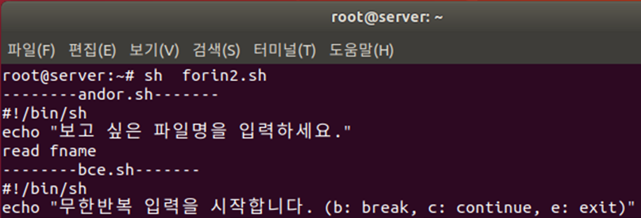
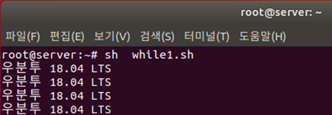
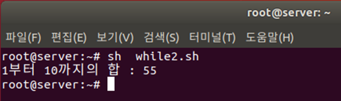
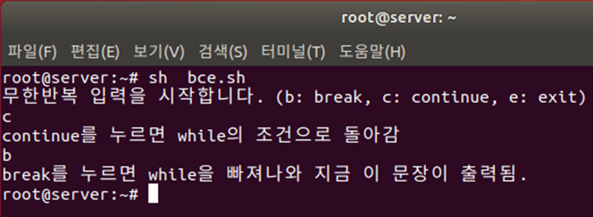

# 반복문

반목을 수행하는 `looping`에 대해서 알아 보도록 하겠습니다.


## while
while은 `조건`이 true 상태일때 `do~done` 사이의 명령들을 반복 실행합니다.

```bash
while 조건
do
    명령문
    명령문
done
```

### 예제 코드

```bash
num=1
while test $num -le 5
do
    echo "Number: $num"
    ((num++))
done
```


### 과제

사용자 이름을 입력받아 /etc/passwd에서 중복된 사용자가 있는지 검색합니다. 중복되지 않는 경우 새로운 사용자를 추가합니다.

```bash
#!/bin/bash
echo -n "New Username: "
read username
while getent passwd $username &> /dev/null
do
	echo "Sorry! that account $username is aleady taken."
	echo "please pick a different username"
	echo -n "New Username: "
	read username
done
sudo useradd -m -s /bin/bash $username
```


## until

until은 `조건`이 false 상태일때 `do~done` 사이의 명령들을 반복 실행합니다.


```bash
until 조건
do
    명령문
    명령문
done
```

```bash
num=1
until test $num -gt 5
do
    echo "Number: $num"
    ((num++))
done
```


## for~in문

변수에 각각의 값을 넣은 후 do 안에 있는 `반복할 문장`을 값의 개수만큼 반복 실행

```bash
for 변수 in [List]
do
    명령문
    명령문
done
```


forin1.sh
```bash
#!/bin/sh
sum=0
for i in 1 2 3 4 5 6 7 8 9 10
do
    sum=`expr $sum + $i`
done
echo "1부터 10까지의 합: "$sum
exit0

```


예제

```bash
for $file in *
do
	ls $file
done
```


예제

```bash
#!/bin/sh
for fname in $(ls *.sh)
do
	echo "----- $fname -----"
	head -3 $fname
done
exit 0
```

* 현재 디렉터리에 있는 셸 스크립트 파일(*.sh)의 이름과 앞 세 행을 출력

* 2행: 2행: fname 변수에 ls *.sh 명령의 실행 결과를 하나씩 넣어 4~5행을 실행

* 4행: 파일 이름을 출력

* 5행: 파일의 앞 세 행을 출력




예제

```bash
#!/bin/sh
while [ 1 ]
do
	echo "Ubuntu"
done
exit 0
```

* 2행: 조건식 위치에 [ 1 ] 또는 [ : ]이 오면 항상 참이므로 4행을 무한 반복

* 취소하려면 Ctrl + C




예제

```bash
#!/bin/sh
sum=0
i=1
while [ $i -le 10 ]
do
	sum=`expr $sum + $i`
	i=`expr $i + 1`
done
echo "1부터 $i 까지의 합은: "$sum
exit 0
```


1부터 10까지의 합계를 출력

* 2행: 합계를 누적할 hap 변수를 초기화

* 3행: 1부터 10까지 증가하는 i 변수를 선언

* 4행: i가 10보다 작거나 같으면 6~7행을 실행

* 6행: hap에 i 변수의 값을 누적

* 7행: i 변수의 값을 1씩 증가




예제


비밀번호 입력

* 3행: mypass 변수에 값을 입력받음

* 4행: mypass 변수의 값이 ‘1234’가 아니면 6~7행을 실행하고, ‘1234’이면 while문을 종료

* 7행: 다시 mypass 변수에 값을 입력받음


### break문, continue문, exit문, return문

* break는 반복문을 종료할 때 주로 사용하며, continue는 반복문의 조건식으로 돌아가게 함

* exit는 해당 프로그램을 완전히 종료

* 함수 안에서 사용할 수 있는 return은 함수를 호출한 곳으로 돌아가게 함




* 3행: 무한 반복을 뜻하며 while [ : ] 또는 while [ true ]와 동일

* 5행: 4행에서 입력한 값에 따라 분기

* 6~7행: b 또는 B가 입력되면 7행의 break를 실행(while문을 종료하고 16행을 실행)

* 8~10행: c 또는 C가 입력되면 9~10행의 continue를 실행(3행의 while문 조건식인 [ 1 ]로 돌아감)

* 11~13행: e 또는 E가 입력되면 12~13행의 exit를 실행(프로그램 자체)

* Exit 번호 확인은 $?를 확인한다. Echo $?

