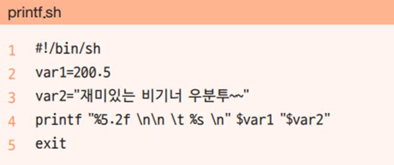

# printf
서식 포맷에 맞추어 출력할 수 있습니다. C언어에서 `printf()` 함수와 동일 합니다.

## 포맷 서식
---
* `%d` , `%i` 숫자
* `%s` 문자열
* `%f` 실수형 숫자

> 정리과제 : 포맷 양식정리


```bash
hojin@hojin3:~/bin$ printf "Name: %s, Score: %i\n" hojin 90
Name: hojin, Score: 90
```
> printf 명령은 이스케이프 문자를 인식하여 동작을 합니다.

### 실습

문자열과 날짜를 같이 출력합니다.
```bash
hojin@hojin3:~/bin$ today=`date +%Y-%m-%d`
hojin@hojin3:~/bin$ printf "Today is %s\n" $today
Today is 2023-03-27
```

포맷 정렬을 통하여 값 출력
> 규격화된 형태로 출력을 만들고 싶을때 사용하면 유용합니다.

```bash
hojin@hojin3:~/bin$ printf "|%10s|%10s|%10.2f|\n" ubuntu hojin 10
|    ubuntu|     hojin|     10.00|
```

```bash
hojin@hojin3:~/bin$ printf "|%-10s|%-10s|%10.2f|\n" ubuntu hojin 10
|ubuntu    |hojin     |     10.00|
```

### 과제
다음셀을 작성하고 실행해 봅니다.

* 과제1
```bash
#!/bin/bash
echo -n "input a directory name:"
read dirname
echo "=========="
date +%Y-%m-%d
echo "=========="
du -sh $dirname 2> /dev/null
```

실행결과
```bash
hojin@hojin3:~/bin$ input1.sh
input a directory name:/home
==========
2023-03-27
==========
64K     /home
```


## 예제
---



* 3행: 공백이 있으므로 “ ”로 묶어야 함

* 4행: %5.2f는 총 다섯 자리이며 소수점 아래 두 자리까지 출력하라는 의미

​    \n은 한 행을 넘기는 개행 문자이고, \t는 Tab 문자이며, %s는 문자열을 출력

​    $var2의 경우 값 중간에 공백이 있으므로 변수 이름을 “ ”로 묶어야 오류 발생 없음


