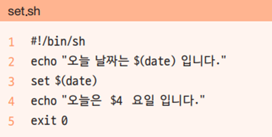

## Bash 쉘의 주요기능


## Quoting Rule

Quoting rule은 메타문자의 의미를 제거하고, 단순한 문자로 변경하여 처리하는 것을 말합니다.


### Meta-Characters란?

메타케릭터는 쉘에서 특별히 의미를 정해 놓은 문자들을 말합니다.

* \ ? ( ) $ ... * * {} [] 등


* `*` all character 의미를 가지고 있는 메타입니다.

```bash
hojin@hojin3:~$ ls
mydata.txt
hojin@hojin3:~$ echo *
mydata.txt
```

echo 명령과 `*` 를 같이 사용하게 되면 모든파일과 디렉터리를 출력하는 ls 명령과 유사합니다.


* `?`는 any single character 의미를 가지고 있습니다.

  ```bash
  echo ??? # 3개의 글자를 가지는 모든 파일
  ```

  

* `{}` 집합 의미를 가지고 있습니다.

  ```bash
  hojin@hojin3:~$ touch file{1..3}
  hojin@hojin3:~$ ls
  file1  file2  file3  mydata.txt
  ```


### 단순 문자 변경

Quoting rule은 메타문자의 의미를 제거하고, 단순한 문자로 변경합니다.  


* backslash(`\`)

  `\` 바로 뒤의 메타 문자는 특별한 의미를 제거

```bash
hojin@hojin3:~$ touch \*\*\*
hojin@hojin3:~$ ls
'***'   file1   file2   file3   mydata.txt
```

`\*`로 작성을 하면, `\`에 의해서 `*` 메타가 무시되기 때문에, `***` 파일이 생성됩니다.  


* Double Quotes(`""`)

  `""`내의 모든 메타 문자의 의미를 제거.

실습

```bash
hojin@hojin3:~$ touch "**"
hojin@hojin3:~$ ls
'**'  '***'   file1   file2   file3   mydata.txt
```


실습

```bash
hojin@hojin3:~$ touch "This is a File"
hojin@hojin3:~$ ls
'**'  '***'  'This is a File'   file1   file2   file3   mydata.txt
hojin@hojin3:~$
```

공백인 메타문자를 무시하고, 공백이 포함된 파일명이 생성되는 것을 볼 수 있습니다.


* Single Quotes(`''`)

  `''`내의 모든 메타 문자의 의미를 제거. 단 `$`와 `''`는 제외함


## Nesting Command

명령어 안에 또 다른 명령어를 삽입할 때 사용합니다.


### $()

리눅스 명령어를 `$()`로 묽어서 실행이 가능합니다.

```bash
hojin@hojin3:~$ echo "Today is $(date)"
Today is Sun Mar 26 17:54:20 KST 2023
```


### 백틱 문자

또는 백틱 ```으로도 가능합니다.

```bash
hojin@hojin3:~$ echo "Today is `date`"
Today is Sun Mar 26 17:55:47 KST 2023
```


### nesting 응용예제

```bash
hojin@hojin3:~$ touch report-$(date +%Y%m%d)
hojin@hojin3:~$ ls
'**'  '***'  'This is a File'   file1   file2   file3   mydata.txt   report-20230326
```

report에 현재날짜가 연결된 파일을 만들 수 있습니다.


## set과 $(명령)
---
리눅스 명령을 결과로 사용하려면 `$(명령)` 형식 이용


* 

* 결과를 파라미터로 사용하려면 set 명령 이용

* 2행: $(date)는 date 명령을 실행한 결과

* 3행: $(date)의 결과가 파라미터 변수 $1, $2, $3, …에 저장

* 4행: 네 번째 파라미터인 요일을 출력


## Alias

`Alias`는 셀 명령에 새로운 이름을 부여하는 것을 말합니다.


### 등록된 alias 확인

```bash
alias 또는 alias 이름
```


실습: 전체 alias 목록

```bash
hojin@hojin3:~$ alias
alias alert='notify-send --urgency=low -i "$([ $? = 0 ] && echo terminal || echo error)" "$(history|tail -n1|sed -e '\''s/^\s*[0-9]\+\s*//;s/[;&|]\s*alert$//'\'')"'
alias egrep='egrep --color=auto'
alias fgrep='fgrep --color=auto'
alias grep='grep --color=auto'
alias l='ls -CF'
alias la='ls -A'
alias ll='ls -alF'
alias ls='ls --color=auto'
```


하나만 확인

```bash
hojin@hojin3:~$ alias ll
alias ll='ls -alF'
```


### Alias 생성

`alias`는 기존의 셀 명령들을 조합하여 새로운 이름의 명령을 생성 합니다.

```bash
alias name='명령'
```


실습

```bash
hojin@hojin3:~$ alias c=clear
hojin@hojin3:~$ alias c
alias c='clear'
hojin@hojin3:~$ c
```


### alias 삭제

```bash
unalias 이름
```


실습

```bash
hojin@hojin3:~$ unalias c
hojin@hojin3:~$ alias c
-bash: alias: c: not found

```


## Prompt

현재 셀의 프롬프트 모양을 변경할 수 있습니다.


현재의 프롬프트 모양을 확인합니다. 프롬프트의 모양은 환경변수`$PS1`에 등록되어 있습니다.

```bash
hojin@hojin3:~$ echo $PS1
\[\e]0;\u@\h: \w\a\]${debian_chroot:+($debian_chroot)}\[\033[01;32m\]\u@\h\[\033[00m\]:\[\033[01;34m\]\w\[\033[00m\]\$

```


### 프롬프트 특수문자

`PS1`환경 변수에 적용할 수 있는 대표적 특수문자들 입니다.

* `\h`: 호스트이름
* `\u`: 사용자이름
* `\w`: 작업 디렉터리 - 절대경로
* `\W`: 작업 디렉터리 - 상대경로
* `\d` : 오늘 날짜
* `\t` :현재 시간
* `\$`: `$` 또는 `#`프롬프트 모영


## 로그인과 환경변수 저장

alias 및 prompt등 환경변수에 등록되는 값는 로그아웃 되면 사라지게 됩니다. 이를 다시 로그인 할 때 기억하여 적용하기 위해서는 별도의 추가 등록 작업이 필요합니다.  

```bash
hojin@hojin3:~$ ls -a ~
'**'    ..              .bashrc       .profile                   'This is a File'   file3
'***'   .bash_history   .lesshst      .sudo_as_admin_successful   file1             mydata.txt
 .      .bash_logout    .motd_shown   .viminfo                    file2             report-20230326
hojin@hojin3:~$
```


사용자 디렉터리에 숨김파일 형태로 `.bashrc` 파일이 있습니다. 이곳에 적용할 설정들을 입력해 두면 됩니다.


```bash
hojin@hojin3:~$ vi .bashrc
```


## Redirection

입출력 방향을 결정합니다.


### 대화 체널

컴퓨터는 키보드등 외부의 기기들을 통하여 입력 받는 것을 `stdin`이라고 합니다. 반대로 모니터등에 출력하는 것을 `stdout`이라고 합니다.


또한, 오류등이 발생된 경우 출력하는 것을 `stderr`라고 합니다.


bash셀은 이러한 입출력을 번호로 관리합니다.

* 0 : stdin
* 1: stdout
* 2: stderr


### 리다이렉션 의미

입출력 리다이렉션은 bash가 지정한 입출력의 번호를 다른 것으로 장치로 재매핑하여 변경하는 것을 말합니다.


* 리다이렉션 숫자(0,1,2)는 생략이 가능

* `>` 파일이 없으면 새롭게 생성. 기존에 파일이 있으면 교체 됩니다.

* `>>`파일이 없으면 새롭게 생성, 기존에 파일이 있으면 마지막 부분에 추가 됩니다.


### 에러 메시지 출력

stderr 와 리다리엑션을 통하여 에러 메시지를 별도의 파일 및 출력 제한을 할 수 있습니다.


### 에러 로그파일 만들기

```bash
hojin@hojin3:~$ ls aaa.txt
ls: cannot access 'aaa.txt': No such file or directory
hojin@hojin3:~$ ls aaa.txt 2> error.log
hojin@hojin3:~$ ls
'**'  '***'  'This is a File'   error.log   file1   file2   file3   mydata.txt   report-20230326
hojin@hojin3:~$
```

에러 메시지를 별도의 `error.log`에 기록을 하였습니다.


### 출력 제한 하기

리다이렉션으로 화면출력을 제한합니다.

```bash
hojin@hojin3:~$ ls file1 file100 2> /dev/null
file1
hojin@hojin3:~$
```

존재하는 file1은 출력이 되나 존재하지 않는 file100은 에러로 출력되지 않고, 쓰레기장 파일로 전송하여 소각합니다.


## Pipeline

여러 명령들을 조합하여 사용하는 방법입니다.


### 명령어 체인

* 명령의 실행결과를 다음 명령의 입력으로 전달
* 리눅스 명령어를 조합하여 사용

```
명령1 | 명령2 | 명령3 
```

명령1의 결과를 명령2의 입력으로 처리합니다. 명령2의 결과를 명령3의 입력으로 처리합니다.


### 실습

`ls` 명령으로 출력되는 파일의 줄수를  다시 wc로 카운팅 하는 동작

```
hojin@hojin3:~$ ls -l | wc -l
10
```


