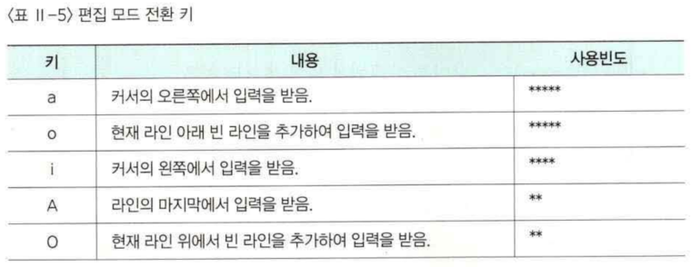

# vi
vi는 리눅스에서 가장 널리 사용되는 명령어 기반의 텍스트 에디터 중 하나입니다. vi는 Unix 시스템에서 개발되어 널리 사용되며, 리눅스의 대부분 배포판에서 기본적으로 설치되어 있습니다. 리눅스에서 대표적인 `vi`에디터에 대해서 알아 봅니다.

## vi 에디터
대부분 gui 환경의 컴퓨터 사용자라면, 텍스트 기반의 문서편집기가 익숙하지 않을 것입니다.  

vi는 명령어 기반의 편집기이기 때문에 초기에는 사용법이 어려울 수 있습니다. 하지만 익숙해지면 효율적인 편집이 가능하며, 터미널 환경에서도 사용이 가능합니다. 또한, vi는 다양한 모드를 지원하기 때문에 편집 중에도 쉽게 다른 기능을 수행할 수 있습니다.

vi는 기본적으로 명령 모드(Command Mode), 입력 모드(Insert Mode), 마지막 행 모드(Last Line Mode)의 3가지 모드를 지원합니다. 명령 모드에서는 커서 이동 및 삭제, 복사, 붙여넣기 등의 기능을 수행할 수 있고, 입력 모드에서는 텍스트 입력이 가능합니다. 마지막 행 모드에서는 파일 저장, 종료 등의 명령을 수행할 수 있습니다.

vi는 초기 학습 곡선이 높지만, 일단 익숙해지면 매우 강력한 편집기입니다. 따라서 리눅스 시스템을 다루는 개발자나 시스템 관리자들은 vi를 숙달하는 것이 좋습니다.

### Vim과의 차이점
vi는 `vi improved`의 준말인 vim의 이전 버전으로, vim은 vi의 기능을 확장하고 개선한 것입니다. vim은 vi와 완벽하게 호환되며, 기본적으로 vi 호환 모드에서 시작합니다.  

그러나 vim은 플러그인, 개선된 문법 강조, 분할 창 및 다른 기능을 추가하여 사용자 경험을 개선했습니다. 따라서 vim은 vi보다 보다 더 다양한 기능과 향상된 사용자 경험을 제공합니다.

## vi 실행
콘솔 터미널에서 `vi` 명령을 입력합니다.

```bash
vi 파일명
```

## vi 명령어
vi 프로그램 안에서는 `명령 모드`, `입력 모드`,  `마지막 행 명령 모드`의 세가지 모드상태가 있으며 각각의 상황에 맞도록 사용합니다.

### 명령모드
간단한 키 명령을 입력하는 상태

* `a` : 현재문자 뒤부터 입력
* `i` : 현재문자 앞부터 입력
* `o` : 현재줄 아래 한줄 삽입
* `:` : 모드 전환(마지막행 입력 모드)


### 입력모드
간단한 키 명령을 입력하는 상태

`esc`키나 `ctrl`+`[`명령으로 모드를 전환할 수 있습니다.




### 마지막행 명령 모드
화면의 마지막 해에서 명려을 입력할 수 있는 모드입니다. 하단에 `:`가 표시됩니다.


## 편집기 활용

편집할때 유용한단어의 검색, 문자열 바꾸기, 기타유용한 명령에 대하여 학습합니다.


### 단어검색

```bash
:/단어 # 위에서 아래로 찾음
:?단어 # 아래에서 위로 찾음
```


### 문자열 변경


## 오류해결
키보드 화살표 오동작
https://m.blog.naver.com/PostView.naver?isHttpsRedirect=true&blogId=thesalja2&logNo=220412268002
