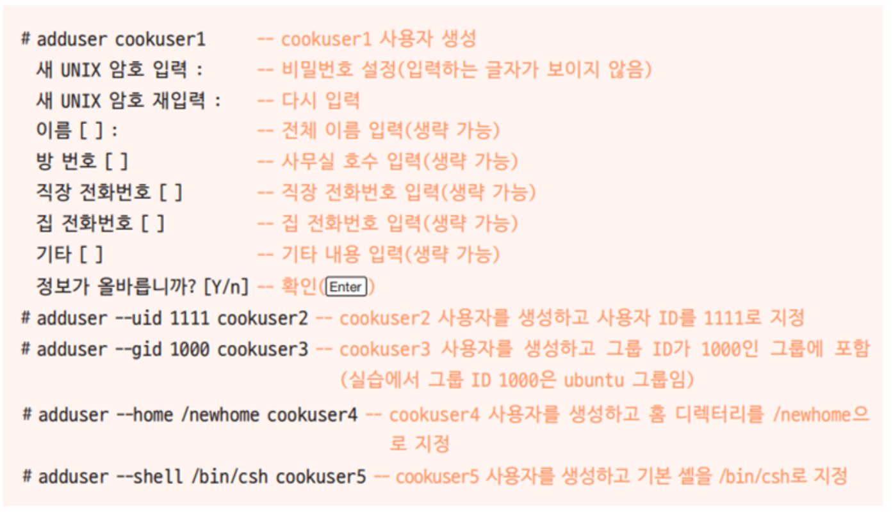

# 사용자 계정
리눅스 시스템에 사용자를 추가하고 삭제하는 방법에 대해서 알아 보도록 합니다.

## adduser
`addUser` 명령은 새로운 사용자를 추가합니다. adduser 명령어를 실행하면 `/etc/passwd`, `/etc/shadow`, `/etc/group`파일에 새로운 행이 추가됩니다.




## 사용자 속성 변경
등록된 사용자의 속성을 변경합니다.
```
usermod --shell /bin/sh 사용자명
usermod --groups 그룹명 사용자명
```

## 사용자 삭제
등록된 사용자를 삭제합니다.
```
userdel 사용자명
```

일반적인 `userdel` 명령은 사용자 목록에서만 삭제를 할뿐, 이 사용자가 작업한 작업 데이터까지 삭제를 하는 것은 아닙니다. 작업 디렉터리까지 삭제를 할때에는 `-r` 옵션을 사용합니다.

```
userdel -r 사용자명
```

