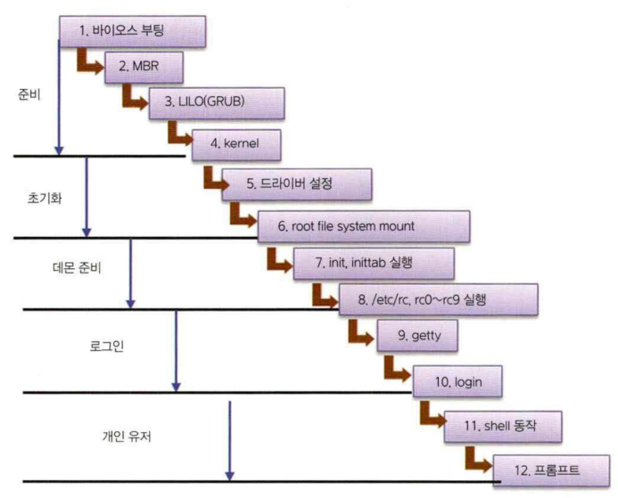
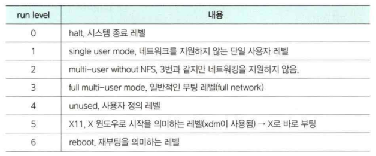

# 리눅스 부팅
리눅스는 단계별 과정을 통해 리눅스 시스템이 부팅됩니다. 리눅스는 다른 운영체제와 달리 초기화 과정이 상당히 자세하고 복잡합니다. 그러나 이를 통해 사용자가 시스템의 상태를 더욱 정확하게 파악할 수 있으며, 다양한 설정을 변경하여 커스터마이징할 수 있습니다.

## 단계별 부팅 과정
리눅스 시스템에 처음 전원이 들어오면 필요한 단계를 거친 후 시용자가 서용 기능한 상태로 부팅이 완료된다. 

## BIOS/UEFI
컴퓨터가 켜짐과 동시에 BIOS(또는 UEFI)가 실행됩니다. BIOS는 컴퓨터의 하드웨어를 `초기화`하고 `부트 디바이스`를 선택합니다.

## 부트 로더
부트 디바이스로 선택된 디스크나 USB 드라이브 등에서 `부트 로더(Boot Loader)`가 실행됩니다. 리눅스에서는 주로 `GRUB(GRand Unified Bootloader)`이 사용됩니다. 부트 로더는 `커널 이미지를 로드`하고 `초기화`합니다.

## 커널 로드
부트 로더가 커널 이미지를 로드하고 초기화합니다. 커널은 시스템 자원을 초기화하고 루트 파일 시스템을 마운트합니다.

## init 프로세스
커널이 초기화되면 init 프로세스가 실행됩니다. init 프로세스는 시스템의 `런레벨`을 결정하고 필요한 서비스와 데몬을 시작합니다.

## 런레벨
리눅스는 다중 사용자 시스템으로 설계되어 있기 때문에 런레벨(Run Level)이라는 개념이 있습니다. 런레벨은 시스템이 동작하는 모드를 나타내며, 각 런레벨에서 실행되는 서비스와 데몬이 정의됩니다.

## 로그인
마지막으로 로그인 화면이 표시되며, 사용자가 로그인합니다. 로그인 후에는 각 사용자에게 해당하는 런레벨에 맞는 서비스와 데몬이 실행됩니다.

