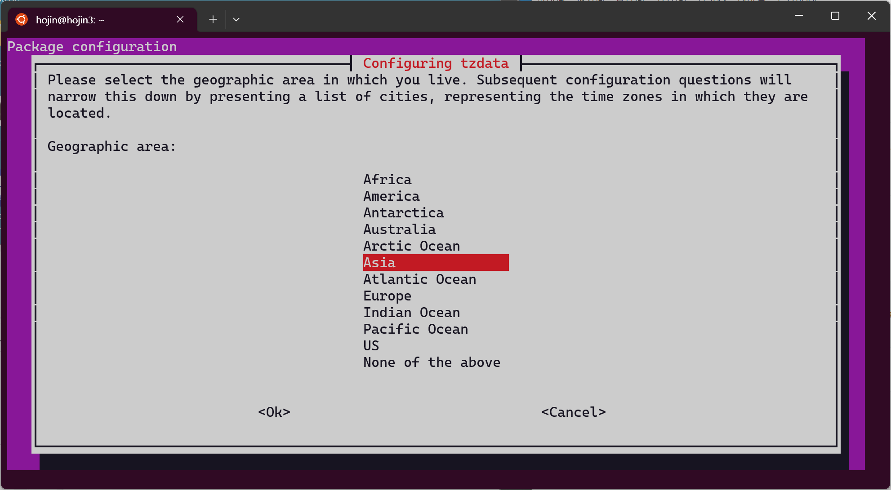

# 시스템 체크
패키지를 설치하기 전에 리눅스 시스템의 상태를 확인합니다.

## 우분투 버젼체크

자신의 현재 우분투 리눅스의 버젼을 확인 하고 싶다면 다음과 같이 명령을 입력합니다.

```
hojin@hojin3-Ubuntu:~$ lsb_release -a
No LSB modules are available.
Distributor ID: Ubuntu
Description:    Ubuntu 22.04.2 LTS
Release:        22.04
Codename:       jammy
```

## 리눅스 및 자원확인

## 설치 준비

리눅스 버젼체크
```bash
hojin@hojin3:~$ uname -a
Linux hojin3 5.15.90.1-microsoft-standard-WSL2 #1 SMP Fri Jan 27 02:56:13 UTC 2023 x86_64 x86_64 x86_64 GNU/Linux
```

Ubuntu 버전체크
```bash
hojin@hojin3:~$ cat /etc/issue
Ubuntu 22.04.1 LTS \n \l
```

하드 용량체크
```bash
hojin@hojin3:~$ df -h
Filesystem      Size  Used Avail Use% Mounted on
none            7.8G  4.0K  7.8G   1% /mnt/wsl
none            275G  131G  144G  48% /usr/lib/wsl/drivers
none            7.8G     0  7.8G   0% /usr/lib/wsl/lib
/dev/sdd       1007G 1012M  955G   1% /
none            7.8G   80K  7.8G   1% /mnt/wslg
rootfs          7.8G  1.9M  7.7G   1% /init
none            7.8G     0  7.8G   0% /run
none            7.8G     0  7.8G   0% /run/lock
none            7.8G     0  7.8G   0% /run/shm
none            7.8G     0  7.8G   0% /run/user
none            7.8G   72K  7.8G   1% /mnt/wslg/versions.txt
none            7.8G   72K  7.8G   1% /mnt/wslg/doc
drvfs           275G  131G  144G  48% /mnt/c
drvfs           1.6T  572G  996G  37% /mnt/d
```

메모리 체크
```bash
hojin@hojin3:~$ free -m
               total        used        free      shared  buff/cache   available
Mem:           15776         336       15303           2         136       15211
Swap:           4096           0        4096
```

## 패키지 목록 업데이트
설치를 하기 전에 최신의 페키지 목록을 업데이트 합니다.

```bash
hojin@hojin3:~$ sudo apt update
[sudo] password for hojin: # 패스워드 입력
```

패키지 프로그램 최신 버전 패치
```bash
hojin@hojin3:~$ sudo apt upgrade

```

## 시스템 설정

타임존 시간 설정
```bash
hojin@hojin3:~$ sudo dpkg-reconfigure tzdata
[sudo] password for hojin:

Current default time zone: 'Asia/Seoul'
Local time is now:      Sat Apr  1 18:21:53 KST 2023.
Universal Time is now:  Sat Apr  1 09:21:53 UTC 2023.
```





## hostname 설정

`hostname`은 서버의 이름을 정하는 것입니다. 서버의 이름을 잘 정리해 두는 것은, 다수의 서버를 운영 관리할 때 매우 편리합니다.


다음과 같이 콘솔의 프롬프트를 보면 서버의 이름이 `hojin3`로 되어 있는 것을 볼 수 있습니다. `@`앞의 내용은 지금 접속한 사용자 아이디를 의미합니다.

```bash
hojin@hojin3:~$
```


호스트이름 변경은 `/etc/hostname` 에 설정되어 있습니다.

```bash
vi /etc/hostname
```


예제로 호스트명을 `hojin3-ubuntu`로 변경해 봅니다. 하지만, 아직 프롬프트에서 호스트명은 변경되어 있지 않습니다. 


변경된 호스트명을 적용하기 위해서는 다음과 같이 명령을 입력합니다.

```bash
sudo hostname -F /etc/hostname
```

이제 서버를 재접속 해보도록 합니다. 다음과 같이 호스트명이 변경된 것을 확인할 수 있습니다.

```bash
hojin@hojin3-Ubuntu:~$ hostname
hojin3-Ubuntu
```

