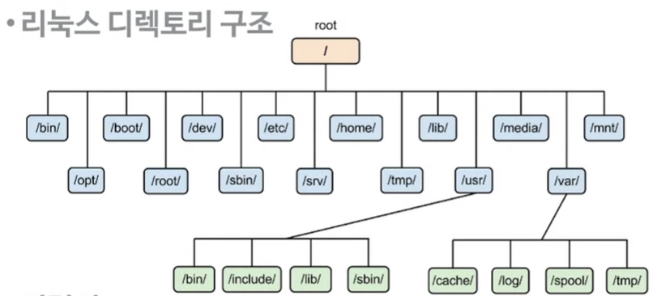

# 운영체제의 파일 시스템

## 파일 시스템이란?
운영체제의 파일 시스템은 파일을 저장하고 관리하는 방식을 정의하는 체계입니다. 파일 시스템은 하드 디스크나 다른 저장 장치에 파일을 구성하고 저장하는 방식을 결정합니다. 이를 위해 파일 시스템은 디렉토리 구조, 파일 이름 규칙, 파일 액세스 권한 및 파일 저장 방식 등을 결정합니다.

일반적으로 파일 시스템은 디렉토리 구조로 구성되어 있습니다. 이 구조는 파일을 저장하는 디렉토리와 하위 디렉토리를 가질 수 있으며, 파일 및 디렉토리 이름을 관리합니다. 또한 파일 시스템은 파일에 대한 액세스 권한을 관리하고, 파일을 물리적인 디스크 공간에 배치하는 방법을 결정합니다.

파일 시스템은 또한 디스크의 빈 공간을 관리하고, 파일을 저장하기 위해 필요한 디스크 공간을 할당합니다. 이를 위해 파일 시스템은 데이터 블록과 인덱스 블록을 사용합니다. 데이터 블록은 파일에 대한 실제 데이터를 저장하고, 인덱스 블록은 파일의 데이터 블록을 참조하기 위한 정보를 저장합니다.

운영체제의 파일 시스템은 파일을 안전하게 저장하고 관리하는 역할을 합니다. 파일 시스템이 잘 설계되고 구현된다면, 파일 손상이나 데이터 손실을 방지할 수 있으며, 파일에 대한 효율적인 액세스와 관리가 가능합니다.

## 리눅스의 파일 시스템 구조
운영체제는 시스템이 필요한 다양한 디렉터리와 파일들을 미리 생성하여 관리합니다.

> 디렉터리는 계층적인 구조로 만들어져 있습니다. 다른말로 `파일시스템`이라고도 합니다.

## 리눅스 파일 시스템의 특징
리눅스 파일 시스템의 특징은 다음과 같습니다.

* 계층적인 디렉토리 구조: 리눅스 파일 시스템은 계층적인 디렉토리 구조를 가집니다. 최상위 디렉토리는 / (루트)로 시작하며, 하위 디렉토리를 계속해서 생성할 수 있습니다.

* 모든 것은 파일: 리눅스 파일 시스템은 모든 것을 파일로 취급합니다. 이는 하드웨어, 소프트웨어, 프로세스, 디바이스, 네트워크 등을 모두 파일로 취급한다는 뜻입니다.

* 대소문자 구분: 리눅스 파일 시스템은 대소문자를 구분합니다. 즉, 파일 이름이나 디렉토리 이름에서 대소문자를 구분하여 작성해야 합니다.

* 파일 시스템의 일관성: 리눅스 파일 시스템은 일관성을 유지합니다. 이는 파일 시스템이 갑작스런 시스템 종료나 다운 등의 상황에서도 데이터 손실이나 손상 없이 복구될 수 있다는 것을 의미합니다.

* 다양한 파일 시스템 지원: 리눅스는 다양한 파일 시스템을 지원합니다. 예를 들어, ext2, ext3, ext4, XFS, NTFS 등의 파일 시스템을 지원합니다.

* 파일 권한 관리: 리눅스 파일 시스템은 파일과 디렉토리에 대한 권한 관리를 지원합니다. 이를 통해 파일이나 디렉토리에 대한 액세스 권한을 설정할 수 있으며, 보안을 강화할 수 있습니다.

* 마운트: 리눅스 파일 시스템은 다른 파일 시스템을 마운트하여 사용할 수 있습니다. 이를 통해 다른 운영체제에서 만든 파일 시스템을 사용할 수 있습니다.
