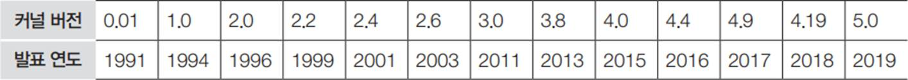

# 커널(Kernal)

## 커널의 구성

* 안정 버전(stable version): 이미 검증된 개발 완료 코드로 구성

* 메인라인 버전(mainline version): 토르발스가 개발 중인 버전, 안정 버전이 나오기 전에 추 가된 기능을 미리 접하고 싶을 때 사용

* 프리패치 버전(prepatch version): 안정 버전이 나오기 전에 추가된 기능을 미리 접하고 싶 을 때 사용

 

## 커널 버전 업그레이드

* 2019년 5월을 기준으로 안정화된 최신 커널은 5.1.15 버전

* 파일 이름에 붙은 숫자 5.1.15의 5는 주버전(major version), 1은 부버전(minor version),

15는 패치 버전(patch version)을 의미

* 배포판에 포함된 기본 커널을 사용자가 직접 최신 커널로 업그레이드할 수 있으며, ‘커널 업그레이드’ 또는 ‘커널 컴파일’이라고 함

 

