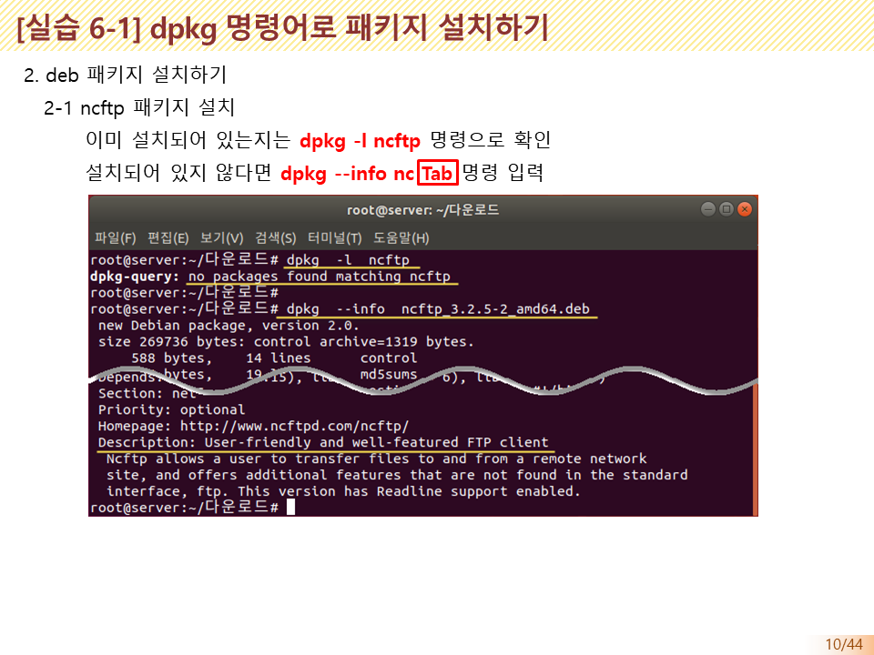
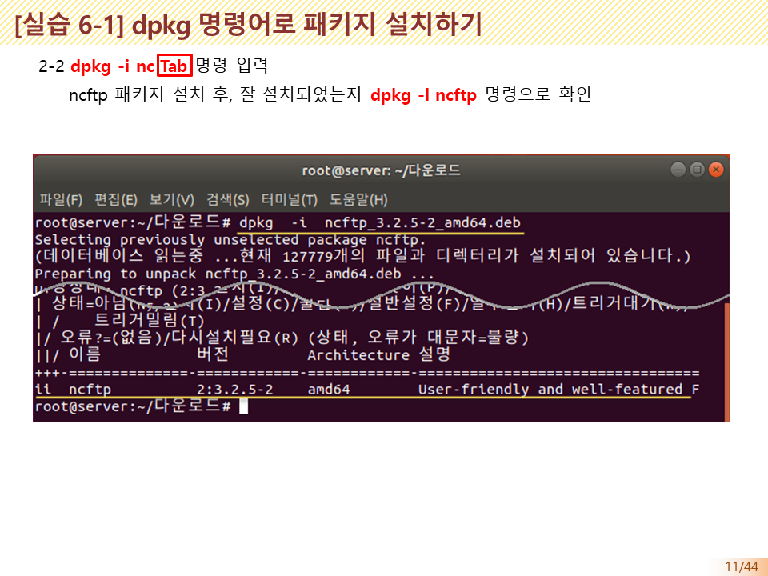
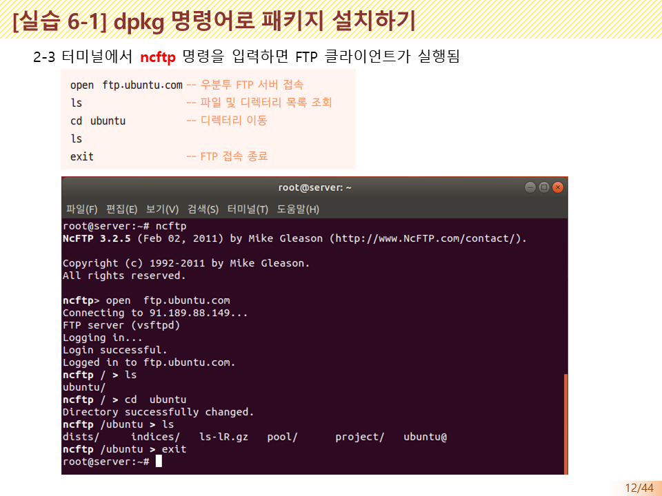
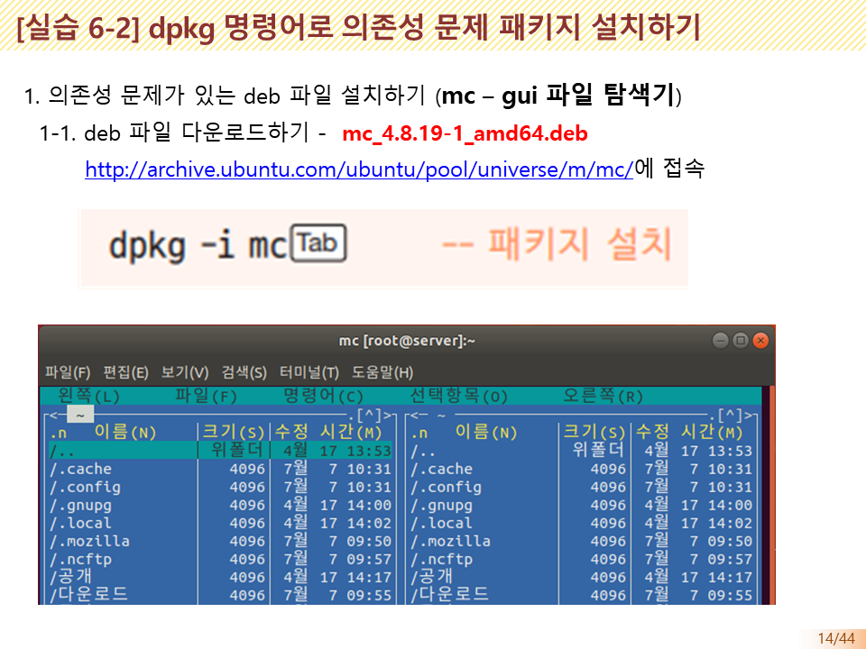
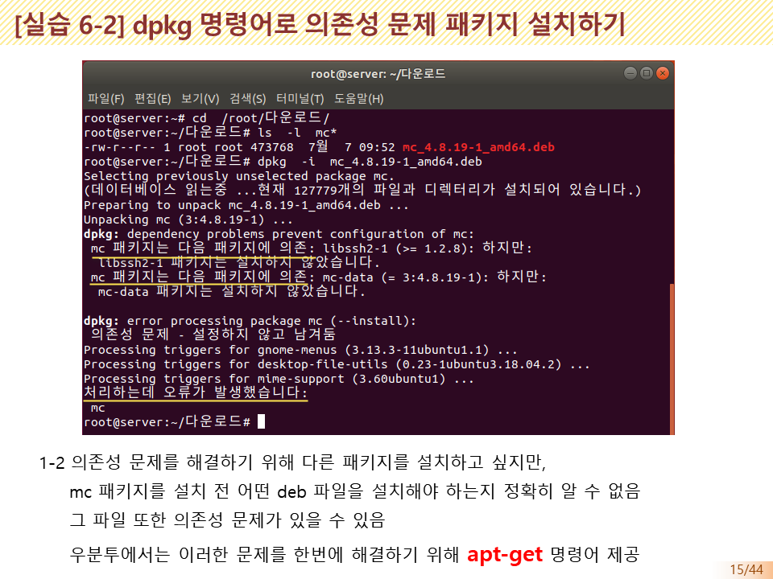

# DPKG

## 자주 사용하는 dpkg 명령어 옵션

* -i 또는 --install

  > 패키지를 설치하는 옵션 `dpkg -i 패키지명.deb`

* -r 또는 --remove

  > 설치되어 있는 패키지를 삭제하는 옵션 `dpkg -r 패키지명`

* -p 또는 --purge

  > 설치되어 있는 패키지와 설정 파일을 모두 삭제하는 옵션 `dpkg -P  패키지명`

* -l 또는 -L

  > 패키지 관련 정보와 파일 목록을 보여주는 옵션
  >
  > ```
  > dpkg -l 패키지명 # 설치된 패키지의 정보를 보여줌
  > dpkg -L 패키지명 # 패키지가 설치한 파일 목록을 보여줌
  > ```
  >
  >  
  >
  > ```
  > hojin@hojin3:/etc$ dpkg -l nano
  > Desired=Unknown/Install/Remove/Purge/Hold
  > | Status=Not/Inst/Conf-files/Unpacked/halF-conf/Half-inst/trig-aWait/Trig-pend
  > |/ Err?=(none)/Reinst-required (Status,Err: uppercase=bad)
  > ||/ Name           Version      Architecture Description
  > +++-==============-============-============-============================================
  > ii  nano           6.2-1        amd64        small, friendly text editor inspired by Pico
  > ```


```
hojin@hojin3:/etc$ dpkg -L nano
/.
/bin
/bin/nano
/etc
/etc/nanorc
/usr
/usr/share
/usr/share/doc
/usr/share/doc/nano
/usr/share/doc/nano/AUTHORS
/usr/share/doc/nano/IMPROVEMENTS.gz
/usr/share/doc/nano/NEWS.gz
/usr/share/doc/nano/README.gz
...
```


### `--info 패키지파일명.deb`

아직 설치되지 않은 deb 파일을 조회하는 옵션


```
dpkg --info 패키지파일명.deb # 패키지 파일의 정보를 보여줌,  어떤 기능을 설치하기 전에 deb 파일안에 해당 기능이 포함되었는지 확인
```


```
```


## dpkg의 단점

* 설치 이전에 직접 패키지 다운로드 필요 (패키지 찾는 어려움이 존재, 자동화 안됨)
* 의존성 문제
  - 특정 패키지가 설치되려면 이미 설치되어 있어야 할 패키지가 존재하는 것
  - e.g) 파이어폭스를 실해하고 싶으면 x 윈도구가 반드시 미리 설치되어야 함


> 이러한 문제를 해결하기 위하여 apt-get 이 등장합니다.














