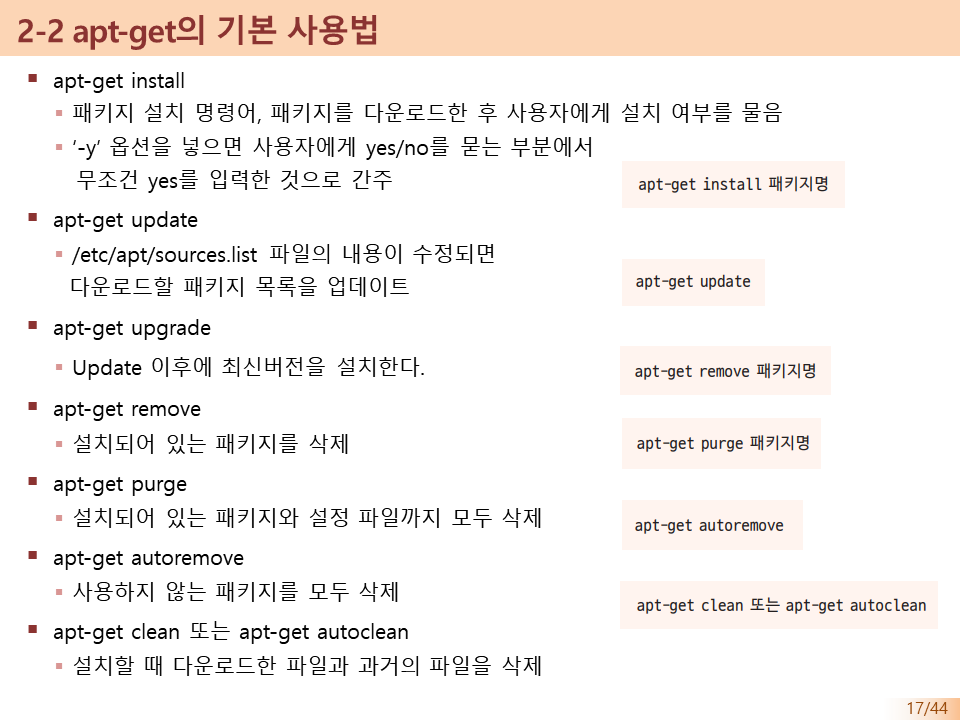
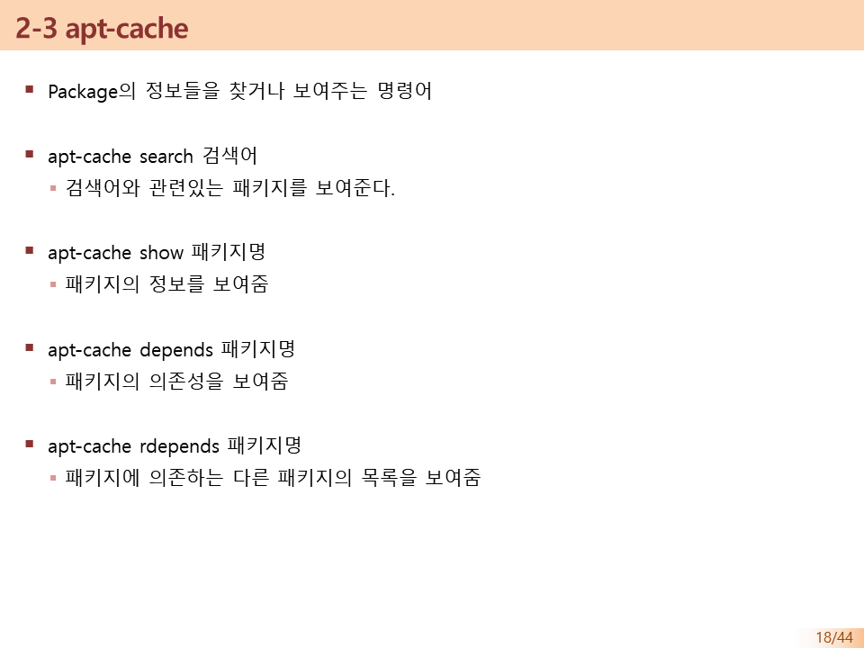
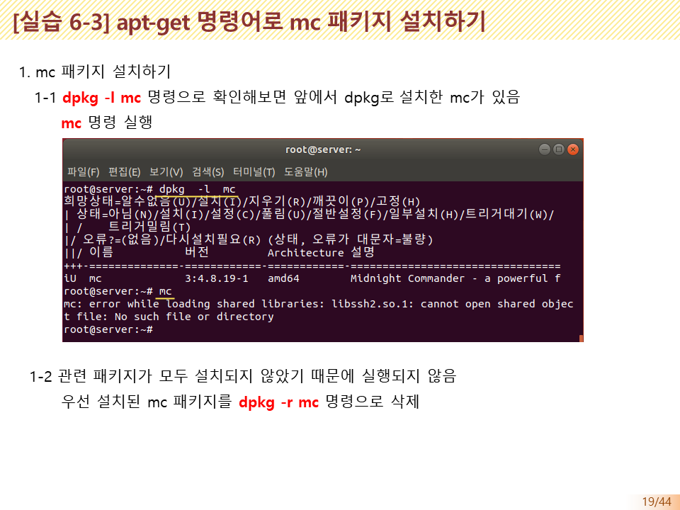
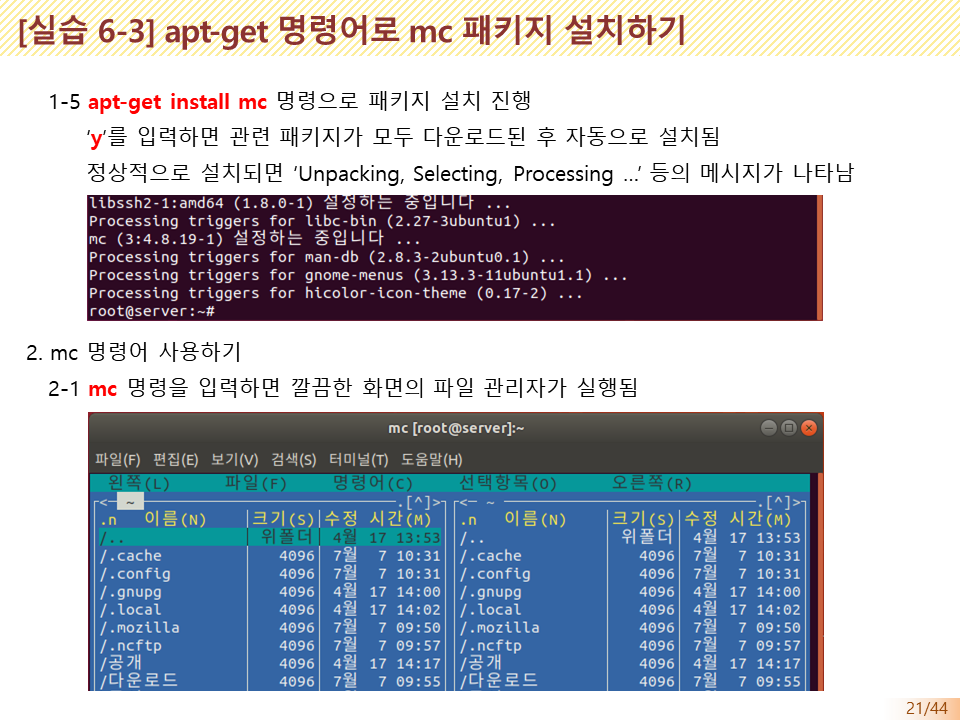
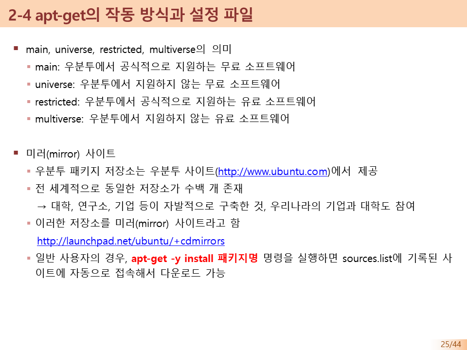
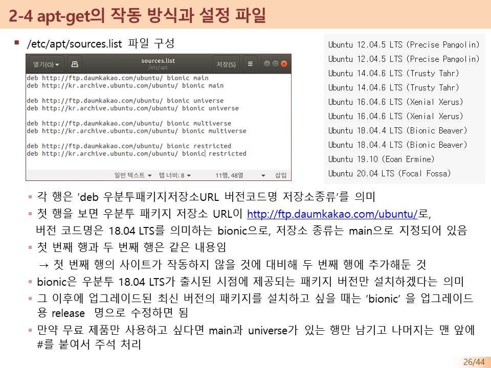
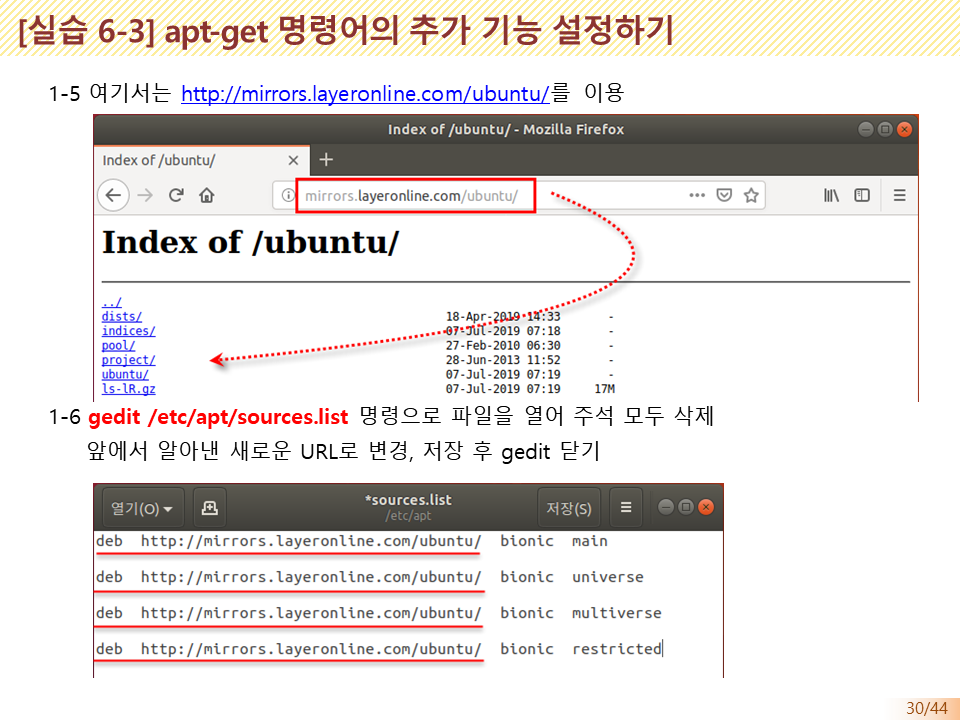
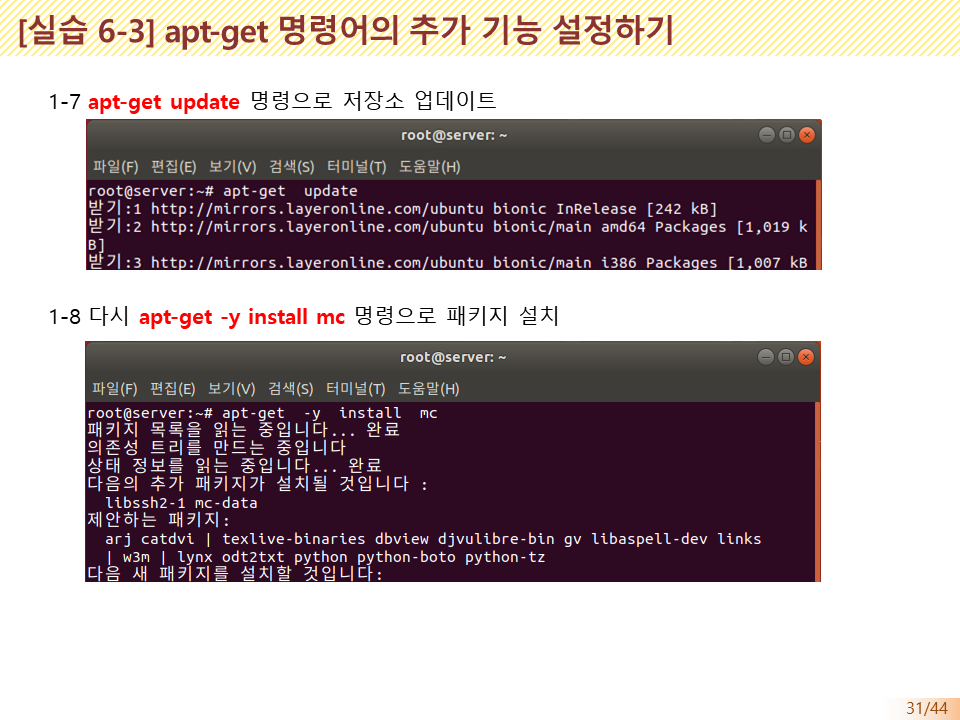
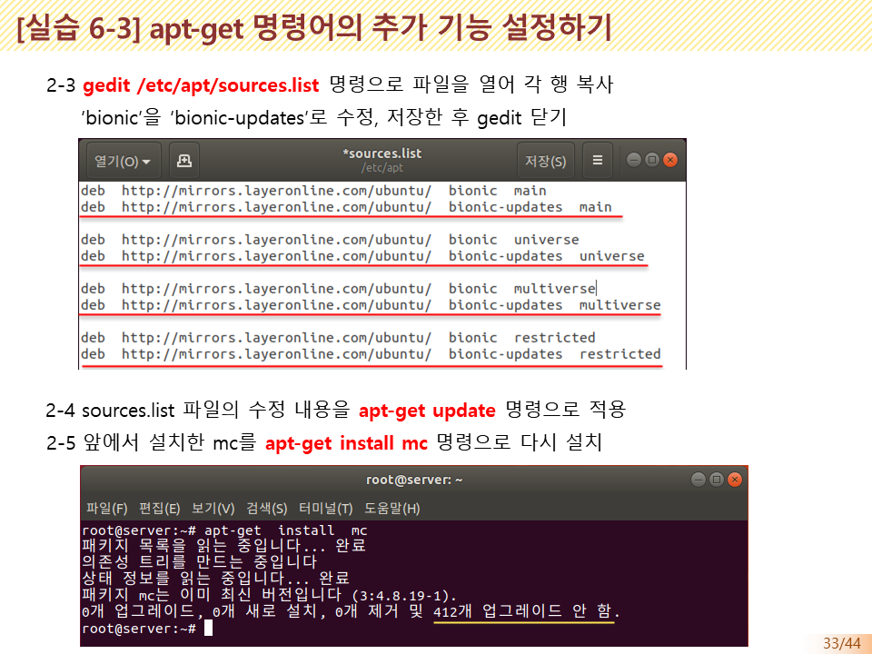
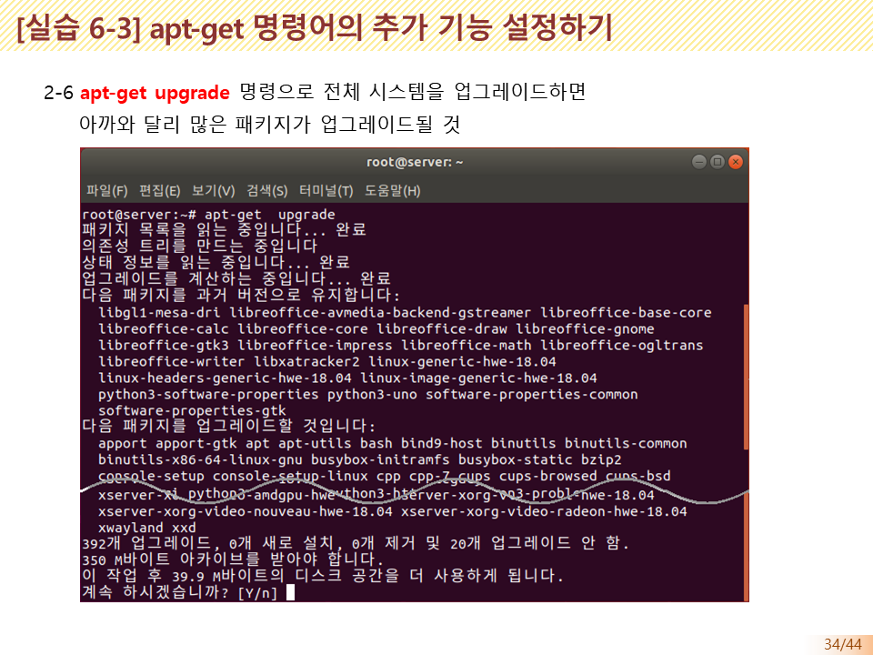

# apt-get

## apt-get의 개요

apt-get 명령어

* apt-get 명령어는 `*.deb`패키지를 설치하는 편리한 도구

* 우분투가 제공하는 deb 파일 저장소에서 자동으로 deb 파일을 다운로드 하여 설치

  > 의존송 문제를 걱정하기 않아도 됨

* dpkg 명령어의 경우, `*.deb`파일을 미리 다운로드한 후 설치햐야 하는 번거로움이 있음

## apt-get  기본 사용법

## apt-cache

패키지의 정보들을 찾거나 보여주는 명령어

* apt-cache search 검색어

  > 검색어와 관련이는 패키지를 보여준다

# apt-get의 작동방식과 설정 파일

