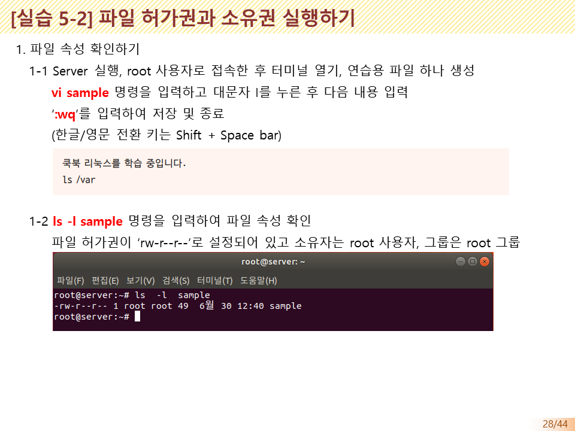
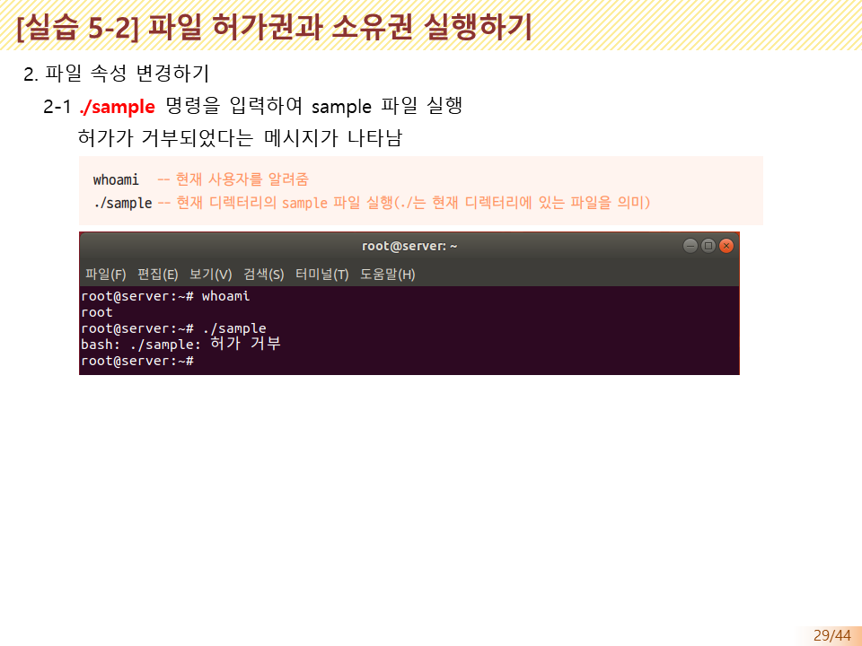
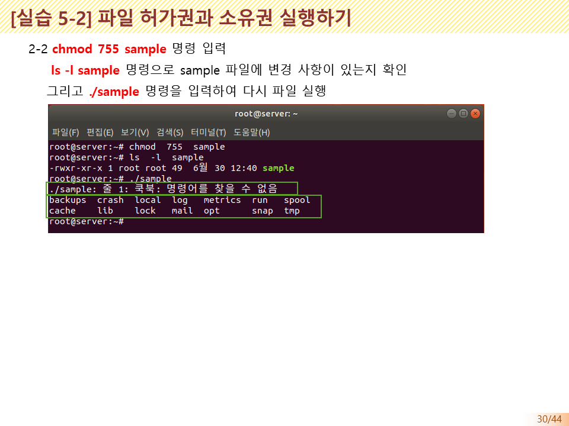
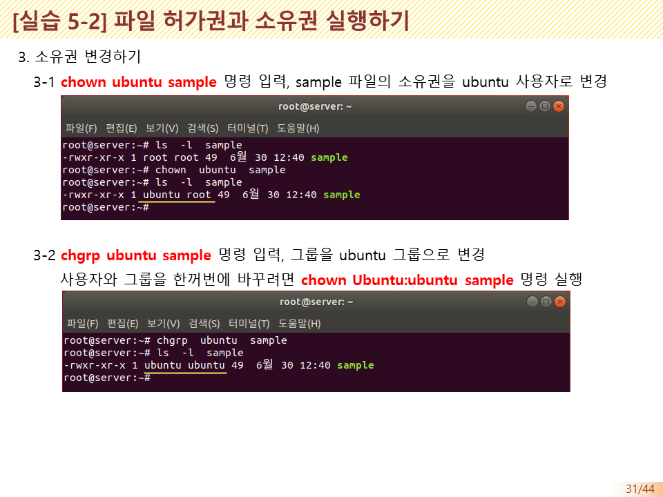

# 권환관리
권한을 표기하거나 관리하는 방법에 대해서 알아봅니다. 
사용자는 서버 시스템을 사용할수 있는 범위의 제한을 가지고 파일과 디렉토리 등에 접근할 수 있도록 되어 있다.

## 파일의 소유와 허가권
시스템 관리지는 모든 권한을 가지고 시스템을 운영할 수 있으며, 일반 시용지는 자기의 영역을 시용하고 이 영역을 다른 사용자들이 사용하거나, 사용하지 못하게 조정할 수 있다


## 권환(Permission)의 이해
사용자와 그룹의 권한(permission)을 표기하는 방법에 대해서 알아 봅니다.

### 파일 허가권, 3단계 권환
권환은 크게 읽기, 쓰기, 실행 3단계의 권환을 가지게 됩니다.

* 읽기권환: 파일을 조회할 수 있습니다.
* 쓰기권환: 파일을 변경하거나 지우기 할 수 있습니다.
* 실행권환: 파일을 실행할 수 있읍니다.

권환은 `rw-`, `r--`, `r--`과 같이 3개씩 끊어서 구분합니다. `r`은 read , w는 Write, x는 execute의 약자 입니다.

두개가 결합된 `rw-`의 의미는 읽기와 쓰기가 허용되어 있다는 의미 입니다. 또한, 실행은 불가능하다는 뜻이 됩니다.
파일의 모든 허용권을 가진 다면 `rxx` 로 표시 됩니다.

### 권한의 숫자 표기법
디렉토리에 대한 권한(permission)을 10개의 자리로 표기하는 방법을 알아 보았습니다. 권한을 관리하는 데는 이러한 10개의 표기법과 함께 이를 숫자로도 나타낼 수 있습니다.


* 첫 번째의 `rw-`는 소유자(user)의 파일 접근 권한을, 두 번째의 `r--`는 그룹(group)의 파일 접근 권한을, 세 번째의 `r--`는 그 외 사용자(other)의 파일 접근 권한을 의미

* 소유자의 허가권을 나타내는 6은 2진수로 110이므로 `rw-`로, 그룹의 허가권을 나타내는 4는 2진수로 100이므로 `r--`로, 그 외 사용자의 허가권을 나타내는 4도 2진수로 100이므로 `r--`로 표현


* 디렉터리(폴더)를 해당 디렉터리로 이동하려면 실행(x) 권한이 반드시 있어야 함

* 따라서 일반적으로 디렉터리에는 소유자, 그룹, 그 외 사용자의 실행(x) 권한이 설정됨

### 권환의 부여
3단계의 권환은 소유자(user), 그룹(group), 다른 사용자(other)에게 각각 부여를 할 수 있습니다.

* root 사용자가 자신의 홈 디렉터리에서 `touch mydata.txt` 명령으로 빈 파일을 만들고 `ls -l`명령으로 실행하면 다음과 같이 나타납니다.

```bash
hojin@hojin3:~$ touch mydata.txt
hojin@hojin3:~$ ls -l
total 0
-rw-r--r-- 1 hojin hojin 0 Mar 22 16:45 mydata.txt
```


## 권환 설정
권한을 설정하는 방식은 `상대모드`와 `절대모드`가 있습니다.

### 상대모드
현재 권한을 기준으로 권한울 제거하거나 부여하는 방식입니다. 
상대 모드 표현 시 아래와 같은 방식으로 표기합니다.

Operator
* `+` : 권환부여
* `-` : 권환제거
* `=` : 권환유지
* `$` : 사용자와 그룹만 실행

Access Class
* `u` : 사용자
* `g` : 그룹 맴버
* `o` : 다른사람
* `a` : 사용자, 그룹, 닮 사람 모두 권환 부여


### 절대모드
* 권한의 숫자 표기법을 이용하여 권한을 표기
* 기존 부여된 권한은 무시되며 새롭게 지정된 권한으로 재설정


## chmod

* 파일 허가권을 변경하는 명령어

* root 사용자 또는 해당 파일의 소유자만 실행 가능

* chmod 777 mydata.txt 명령을 실행하면 모든 사용자가 mydata.txt 파일은 읽고 쓰고 실행할 수 있음

* 상대 모드(symbolic method)로도 사용

* chmod u+x 파일명 명령은 소유자(User)에게 실행(eXecute) 권한을 허가하라(+)는 의미


## 실습









