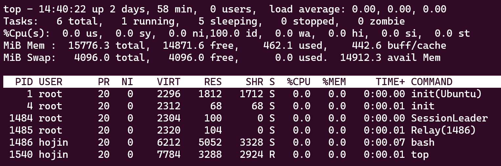

# 프로세스 명령어
프로세스를 백그라운드로 실행시키는 경우, 이 프로세스를 실행하거나, 조회하거나, 중지시키는 방법에 대하여 알아본다.


## 프로세스 기본조회
리눅스 서버 내 프로세스의 실행, 중지, 과부하 등을강 점검하기 위하여 프로세스
를 조회하는 방법에 대하여 알아봅니다.

리눅스는 현재 프로세스상황을 조회할 수 있다.  

### `/proc/` 디렉토리 내의 파일로 프로세스 상황을 인지한다.  
리눅스에서 /proc 디렉터리는 프로세스(process) 정보와 시스템 정보를 동적으로 제공하는 가상 파일 시스템입니다. 이 디렉터리에는 현재 시스템에서 실행 중인 프로세스의 정보, 시스템의 메모리, CPU 정보, 장치 정보 등 다양한 정보가 포함되어 있습니다. /proc 디렉터리의 파일들은 일반 파일이 아니라 가상 파일(virtual file)이며, 파일 내용은 파일 시스템이 아닌 커널(kernel) 메모리에 저장되어 있습니다. 이를 통해 사용자는 /proc 디렉터리의 파일들을 읽고, 각각의 파일에 해당하는 정보를 동적으로 확인할 수 있습니다. /proc 디렉터리의 파일들은 시스템의 상태를 모니터링하거나, 디버깅(debugging) 및 성능 최적화 등 다양한 용도로 활용될 수 있습니다.  

* 프로세스들은 `파일 상태`로 리눅스 서 버에서 관리됨.
* `숫자`로 나타나고 있는 파일이 해당 번호의 프로세스가 시용하고 있는시스템 영역

```bash
hojin@hojin-550XDA:~$ cd /proc
hojin@hojin-550XDA:/proc$ ls
1       1687   1808    189236  1927  2130  2478  3199  44    59   675  953            kallsyms      softirqs
10      1689   1812    189244  2     2131  248   32    440   6    69   98             kcore         stat
103     1697   1814    189372  20    2132  25    3220  441   61   70   acpi           keys          swaps
104     17     1818    189450  2040  2137  2500  3252  442   62   71   asound         key-users     sys
105     1707   182140  189457  2046  2197  2521  326   443   63   72   bootconfig     kmsg          sysrq-trigger
106     1708   182158  189463  2054  2198  2522  3268  444   64   73   buddyinfo      kpagecgroup   sysvipc
107     1714   183518  189471  2062  22    2554  3273  445   640  74   bus            kpagecount    thread-self
1070    1715   184114  189481  2068  2201  26    3283  446   641  75   cgroups        kpageflags    timer_list
108     1716   184115  189492  2082  2202  268   33    447   644  8    cmdline        loadavg       tty
11      17214  184160  189505  2093  2207  269   34    448   645  804  consoles       locks         uptime
1112    17228  184161  189523  2095  2261  27    3462  45    647  83   cpuinfo        mdstat        version
111756  1727   184266  189528  21    227   28    3475  452   648  84   crypto         meminfo       version_signature
113     17285  184351  189544  210   23    281   3498  46    65   85   devices        misc          vmallocinfo
119     1730   1849    189551  2112  2303  29    35    47    650  86   diskstats      modules       vmstat
12      17334  1859    189558  2113  231   3     3568  4771  656  865  dma            mounts        zoneinfo
13      1740   1867    189560  2115  2310  31    37    49    657  87   driver         mtd
1311    17509  186779  189641  2116  232   3167  38    5     658  88   dynamic_debug  mtrr
1376    1752   187253  189643  2117  233   3172  39    50    659  89   execdomains    net
14      1763   188089  189656  2119  234   3173  4     51    660  90   fb             pagetypeinfo
143833  1767   1885    189657  2121  235   3175  40    52    663  91   filesystems    partitions
144016  1773   188596  189669  2123  240   3177  41    53    666  934  fs             pressure
15      1786   188650  1898    2126  245   3183  415   55    668  948  interrupts     schedstat
1537    1797   188685  19      2127  246   3184  427   56    669  950  iomem          scsi
16      1799   188926  1915    2128  247   3185  43    57    67   951  ioports        self
168     1804   189043  1919    2129  2474  3188  438   58    670  952  irq            slabinfo
hojin@hojin-550XDA:/proc$
```


### `/proc/cpuinfo` 파일은 cpu 관련 상황을 알 수 있는 파일이다.
리눅스에서 /proc/cpuinfo 파일은 현재 시스템에서 사용되고 있는 CPU(Central Processing Unit)의 정보를 담고 있는 가상 파일입니다. 이 파일은 파일 시스템이 아닌, 시스템의 메모리에 위치하며, CPU 정보를 동적으로 제공합니다. /proc/cpuinfo 파일에는 각각의 CPU 코어(core)와 캐시(cache) 정보, CPU 제조사, 모델명, 클럭 속도 등의 정보가 포함되어 있습니다. 이 파일은 시스템 관리자나 개발자가 시스템의 CPU 정보를 확인하거나, 프로그램을 개발할 때 최적의 CPU 설정을 선택하는 데에 유용하게 활용될 수 있습니다.  

```bash
hojin@hojin-550XDA:/proc$ cat /proc/cpuinfo
processor       : 0
vendor_id       : GenuineIntel
cpu family      : 6
model           : 140
model name      : 11th Gen Intel(R) Core(TM) i5-1135G7 @ 2.40GHz
stepping        : 1
microcode       : 0xa6
cpu MHz         : 2400.000
cache size      : 8192 KB
physical id     : 0
siblings        : 8
core id         : 0
cpu cores       : 4
중간생략...
```


## PS 명령어
리눅스의 ps 명령은 현재 실행 중인 프로세스(process)의 상태 정보를 보여주는 명령어입니다. ps 명령을 실행하면 시스템에서 실행 중인 모든 프로세스의 목록과 해당 프로세스의 상태, PID(process ID), CPU 및 메모리 사용량, 실행 중인 사용자 등의 정보를 출력합니다. 또한, 사용자가 지정한 조건에 따라 출력을 필터링할 수 있는 옵션도 제공됩니다. ps 명령은 다른 명령어와 함께 사용하여, 특정 프로세스의 PID를 알아내거나, 실행 중인 프로세스를 강제로 종료하는 등의 작업을 수행할 때 유용합니다.  

`ps`(process s tatus)는 프로세스를 조회하는 유용한 명령 입니다. ps 명령 출력 필드의 의미는 다음과 같음. 

-  USER : 프로세스 소유자의 계정이름
-  PPID: 부모프로세스의 PID
-  %CPU : 프로세스의 CPU 시용량
-  %MEM: 프로세스가 사용하는 시스템 메모리 자원량
-  vsz: 가상메모리
-  RSS: 시용된 실제 메모리
-  TIME: 총 CPU 사용시간
-  CMD: 실행된 프로세스 명령어


```bash
hojin@hojin3:/proc$ ps -al
F S   UID   PID  PPID  C PRI  NI ADDR SZ WCHAN  TTY          TIME CMD
0 R  1000  1539  1486  0  80   0 -  1870 -      pts/0    00:00:00 ps
```


## pstree
리눅스의 pstree 명령은 프로세스(process) 간의 계층 구조를 트리 형태로 보여주는 명령어입니다. pstree 명령을 실행하면 현재 시스템에서 실행되고 있는 모든 프로세스를 부모-자식 관계에 따라 트리 형태로 출력합니다. 이를 통해 시스템에서 실행 중인 프로세스들의 종속 관계와 상호 작용을 쉽게 파악할 수 있습니다. pstree 명령은 프로세스가 실행되는 위치와 실행 명령어 등의 정보도 함께 출력합니다. 또한, -p 옵션을 사용하면 각 프로세스의 프로세스 ID(PID)도 함께 출력되어 보다 자세한 정보를 확인할 수 있습니다.  

시스템 프로세스의 부모 자식관계 등 연관관계를 트리 구조.

```bash
hojin@hojin3:/proc$ pstree
init(Ubuntu)─┬─SessionLeader───Relay(1486)───bash───pstree
             ├─init───{init}
             └─{init(Ubuntu)}
```

## top
리눅스의 top 명령은 시스템의 프로세스(process) 상태 및 CPU, 메모리, 스왑(swap) 등의 사용량을 실시간으로 모니터링할 수 있는 명령어입니다. top 명령은 시스템의 상태를 종합적으로 파악할 수 있도록 CPU 사용률, 메모리 사용량, 프로세스 수, 스왑 사용량, 로드 에버리지(load average) 등의 정보를 출력합니다. 또한, top 명령은 프로세스의 상태, ID, 우선순위, CPU 사용량, 메모리 사용량 등의 정보를 리스트로 출력하며, 이를 정렬하여 필요한 정보를 쉽게 확인할 수 있습니다. top 명령은 사용자 입력에 따라 출력되는 정보를 업데이트하며, 일정 간격으로 정보를 갱신하여 시스템 모니터링에 유용합니다.  

프로세스들의 실시간구동상황을 보여줍니다. 가장 상단에 위치한 프로세스가 시스템 자원을 가장 많이 사용하는· 프로세스입니다.




## ulimit
리눅스의 ulimit 명령은 사용자 또는 프로세스가 사용할 수 있는 리소스(resource)에 대한 제한을 설정하는 명령어입니다. 이를 통해 사용자 또는 프로세스가 소비할 수 있는 최대 메모리, 최대 파일 크기, 최대 프로세스 개수 등을 제한할 수 있습니다. ulimit 명령은 사용자의 리소스 사용량을 제어하여 시스템의 안정성과 보안성을 유지하고, 다중 사용자 환경에서 사용 가능한 자원을 균등하게 분배할 수 있도록 합니다. 명령어 옵션을 이용하여 제한할 리소스의 종류와 크기 등을 설정할 수 있습니다.  

`ulimit -a`로 프로세스 자원 한도를 볼수 있습니다.

* 해당서버의 총자원량과사용되고 있는자원량을볼수 있음.
* 시스템 상황을 모니터 링하는 데 유용한 명 령어

```bash
hojin@hojin3:/proc$ ulimit -a
real-time non-blocking time  (microseconds, -R) unlimited
core file size              (blocks, -c) 0
data seg size               (kbytes, -d) unlimited
scheduling priority                 (-e) 0
file size                   (blocks, -f) unlimited
pending signals                     (-i) 63079
max locked memory           (kbytes, -l) 65536
max memory size             (kbytes, -m) unlimited
open files                          (-n) 1024
pipe size                (512 bytes, -p) 8
POSIX message queues         (bytes, -q) 819200
real-time priority                  (-r) 0
stack size                  (kbytes, -s) 8192
cpu time                   (seconds, -t) unlimited
max user processes                  (-u) 63079
virtual memory              (kbytes, -v) unlimited
file locks                          (-x) unlimited
```


## vmstat
리눅스의 vmstat 명령은 시스템의 가상 메모리(virtual memory) 상태를 보여주는 명령어입니다. CPU 사용률, 메모리 사용량, 페이지 스왑(page swap) 등의 정보를 실시간으로 출력하여 시스템의 상태를 모니터링할 수 있습니다. vmstat 명령은 사용자 및 시스템 모드의 CPU 시간, 사용 가능한 자유 메모리, 스왑 사용량, 블록 I/O, 인터럽트, 문맥 교환 등의 정보를 출력합니다. 또한, 명령어 옵션을 이용하여 출력 간격 등을 조정할 수 있습니다.

`vmstat`는 cpu 활동상황을 보여줌

```bash
hojin@hojin3:/proc$ vmstat
procs -----------memory---------- ---swap-- -----io---- -system-- ------cpu-----
 r  b   swpd   free   buff  cache   si   so    bi    bo   in   cs us sy id wa st
 0  0      0 15228012  17128 436300    0    0     0     1    0    2  0  0 100  0  0
```


## jobs
리눅스의 jobs 명령은 백그라운드(background)에서 실행 중인 쉘 작업(job)의 목록을 보여주는 명령어입니다. 작업 번호(job number)와 작업 상태(job status) 등의 정보를 제공하며, 이를 통해 백그라운드에서 실행 중인 작업을 관리할 수 있습니다.

* 작업번호:  '%숫자’는 백그라운드 작업을 지칭.

## fg
리눅스의 fg 명령은 백그라운드(background)에서 실행 중인 쉘 작업(job)을 포그라운드(foreground)로 이동시키는 명령어입니다. 이를 통해 작업을 직접적으로 제어하거나, 작업의 상태 및 출력 결과 등을 확인할 수 있습니다. 작업 번호나 작업 이름 등을 인자로 전달하여 해당 작업을 포그라운드로 이동시킬 수 있습니다.

* fg %작업번호:  백그라운드 작업을 포그라운드 작업으로 전환함.

## bg
리눅스의 bg 명령은 중지(stopped) 상태에 있는 백그라운드(background) 쉘 작업(job)을 다시 실행 상태로 전환하는 명령어입니다. 이를 통해 백그라운드에서 실행 중이던 작업을 일시적으로 중지하거나, 작업을 일시 중단한 후 다시 실행할 수 있습니다. 작업 번호나 작업 이름 등을 인자로 전달하여 해당 작업을 다시 실행 상태로 전환할 수 있습니다.

* bg %작업 번호:  포그라운드 작업을 백그라운드 작업으로 전환함.


## kill
리눅스의 kill 명령은 프로세스(process)를 강제로 종료하는 명령어입니다. kill 명령은 프로세스에 시그널(signal)을 보내어 해당 프로세스를 종료시킵니다. 일반적으로 SIGTERM 시그널을 보내어 프로세스를 정상적으로 종료시키지만, 강제로 종료해야 할 경우에는 SIGKILL 시그널을 보내어 종료시킵니다. 프로세스 ID(PID)나 프로세스 그룹 ID(PGID) 등을 인자로 전달하여 해당 프로세스를 종료시킬 수 있습니다.  

* kill %작업 번호: 해당작업번호의 프로세스를 강제로 끝냄.
* kill PID: 해당 PID의 프로세스를 강제로 끝냄.
