# 원격 접속

## Content

* 텔넷 서버
* SSH 서버
* VNC 서버

## 학습목표
* 텔넷 서버의 작동 개념을 이해하고 설정법을 익힌다.
* 보안이 강화된 ssh 서버의 설정법을 익힌다.
* GUI 접속을 지원하는 VNC 서버의 설정법을 익힌다.

## 준비사항

원격 접속 실습을 위해서 2대의 리눅스 머신이 필요합니다.

* 서버용 리눅스
* 클라이언트용 리눅스

> 하나의 리눅스는 클라이언트로 사용하고, 다른 하느의 linux는 서버로 동작합니다.

## 텔

## 넷 서버의 개요

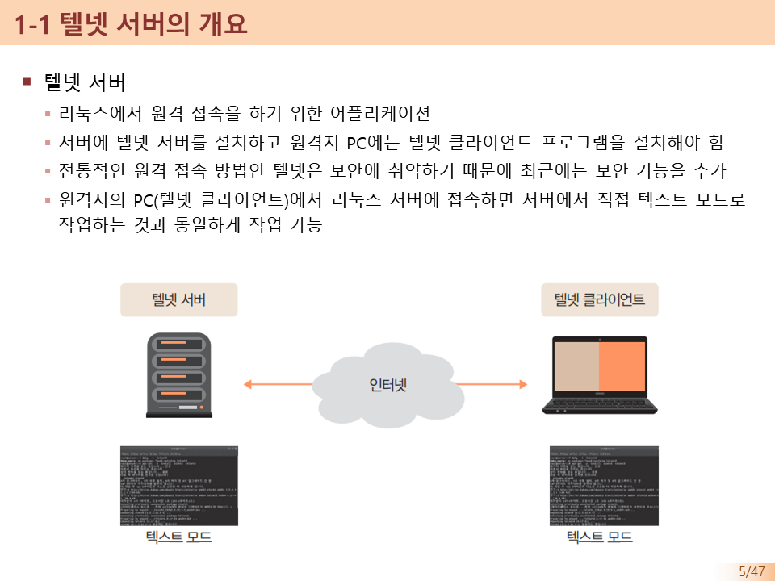

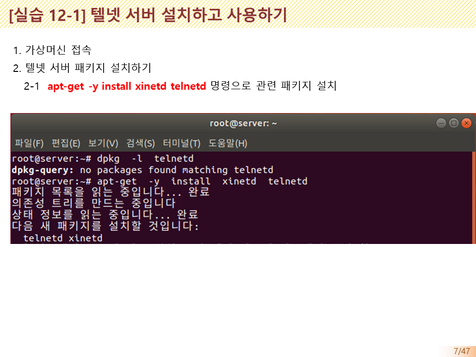

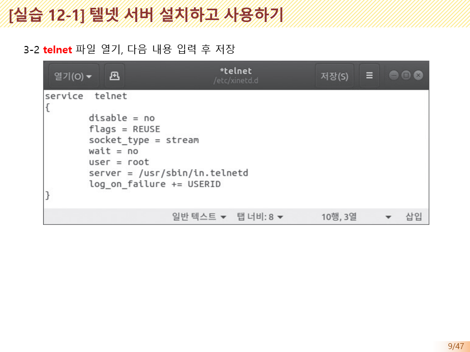

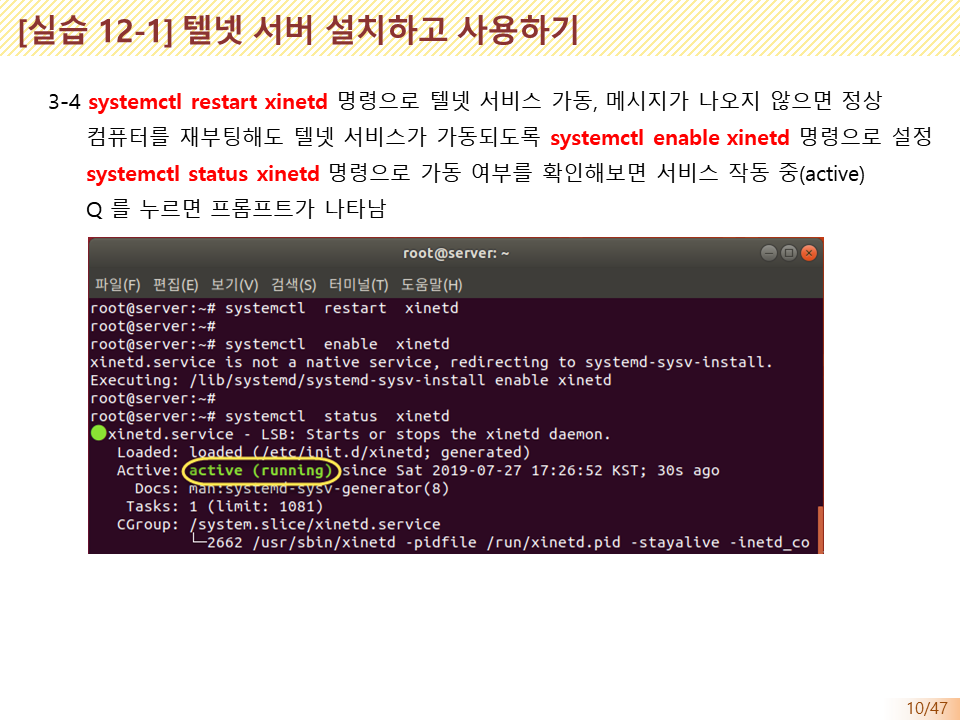

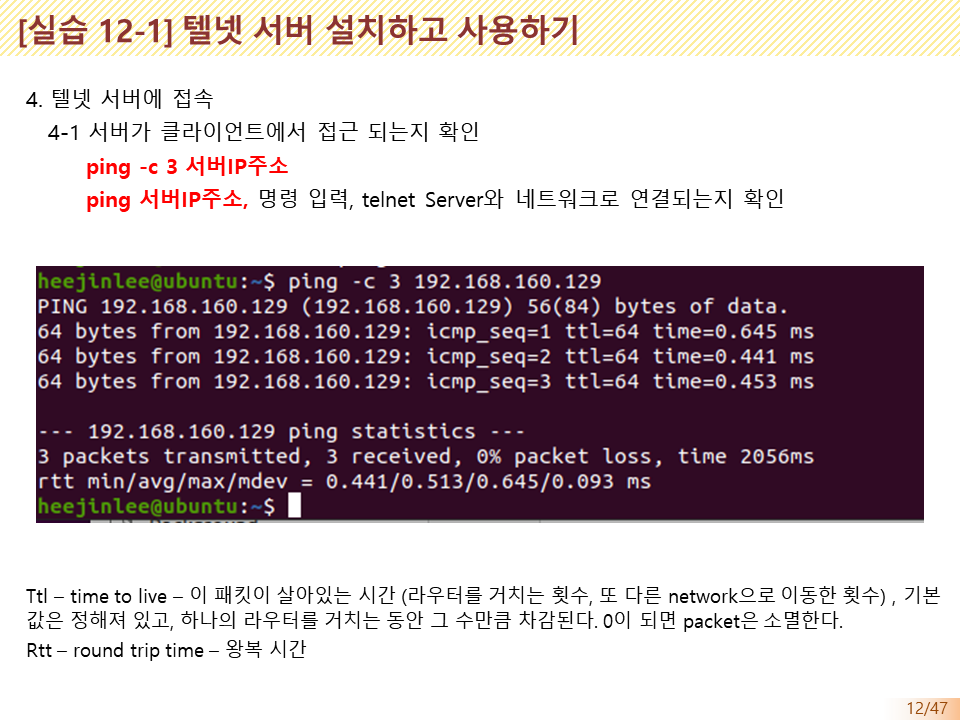

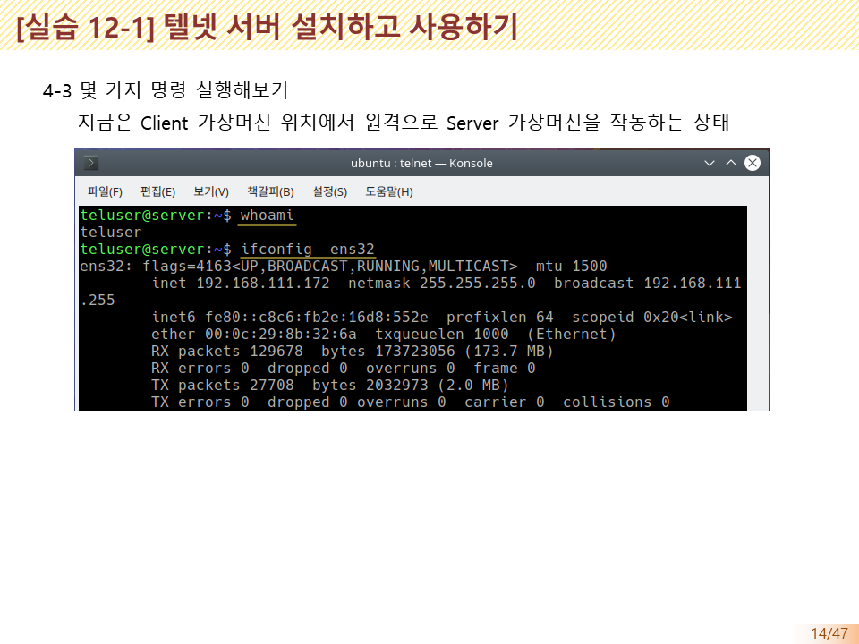

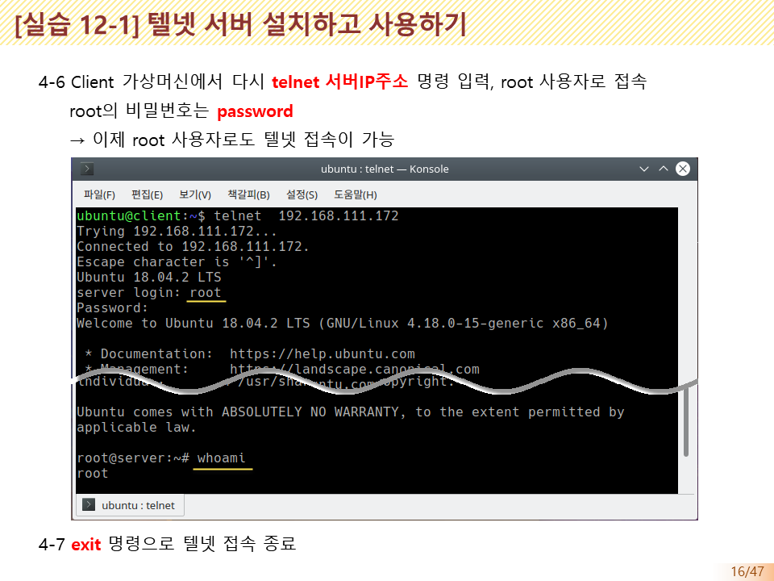

## SSH 서버의 개요

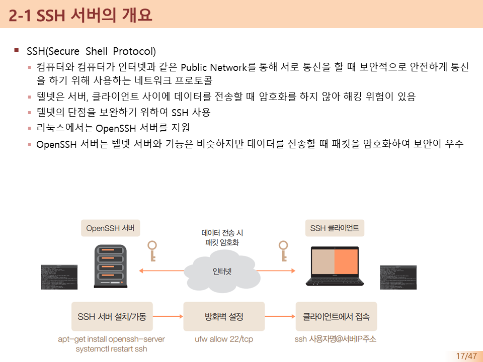

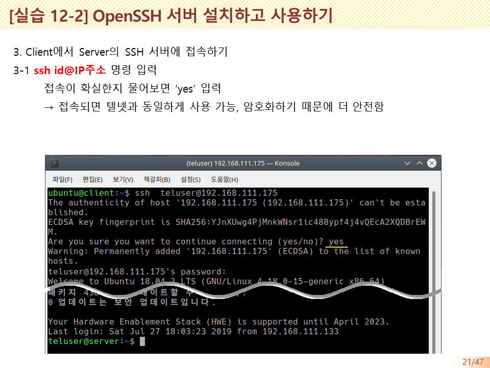

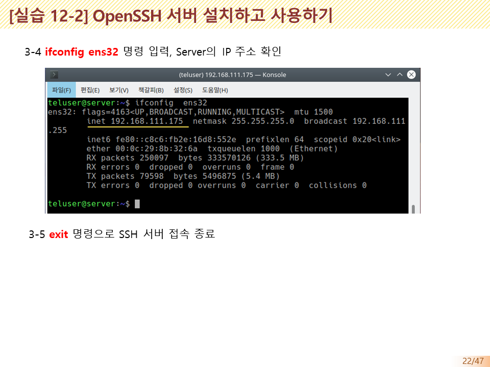

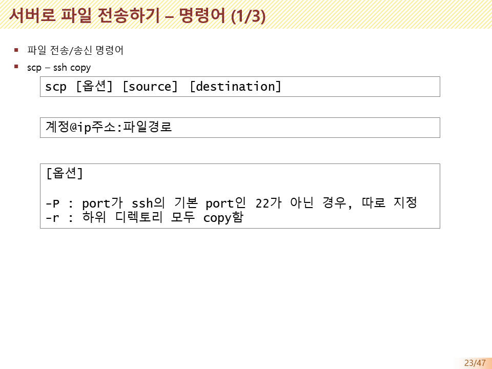

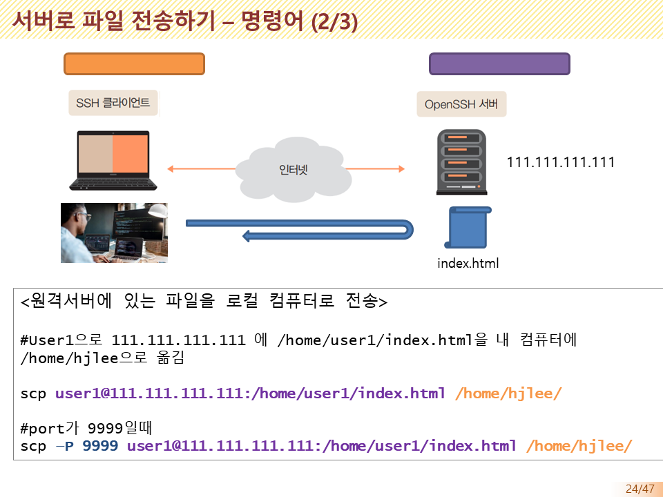

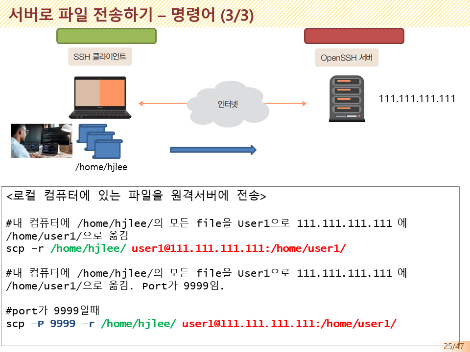

## VNC 서버의 개요
* [vnc](vnc)

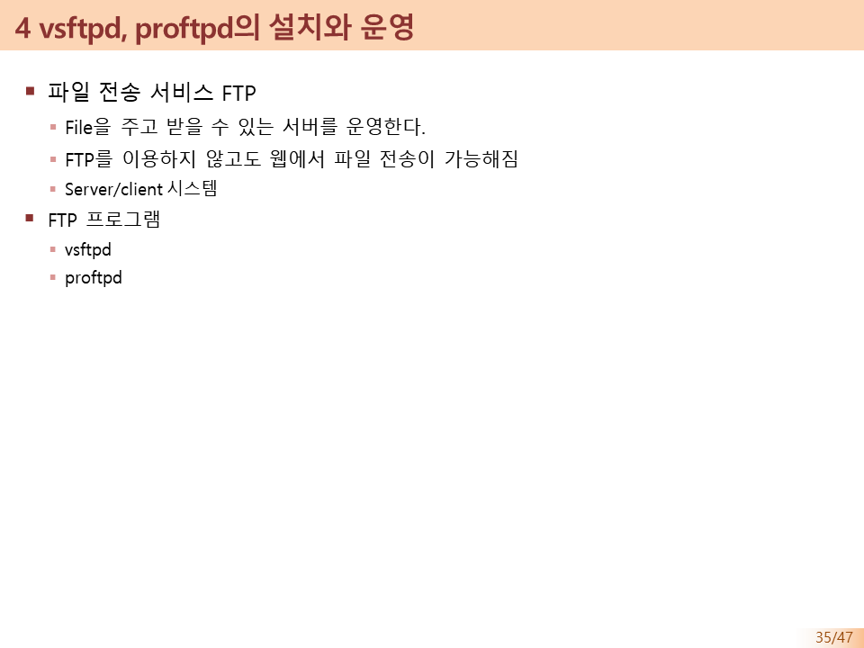

* [vsftp](vsftp)

* [proftp](proftp)

## 실습

* [Netstat](netstat)

