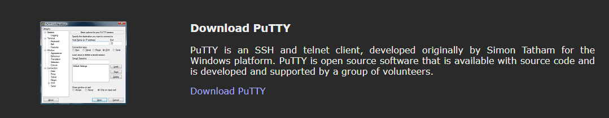
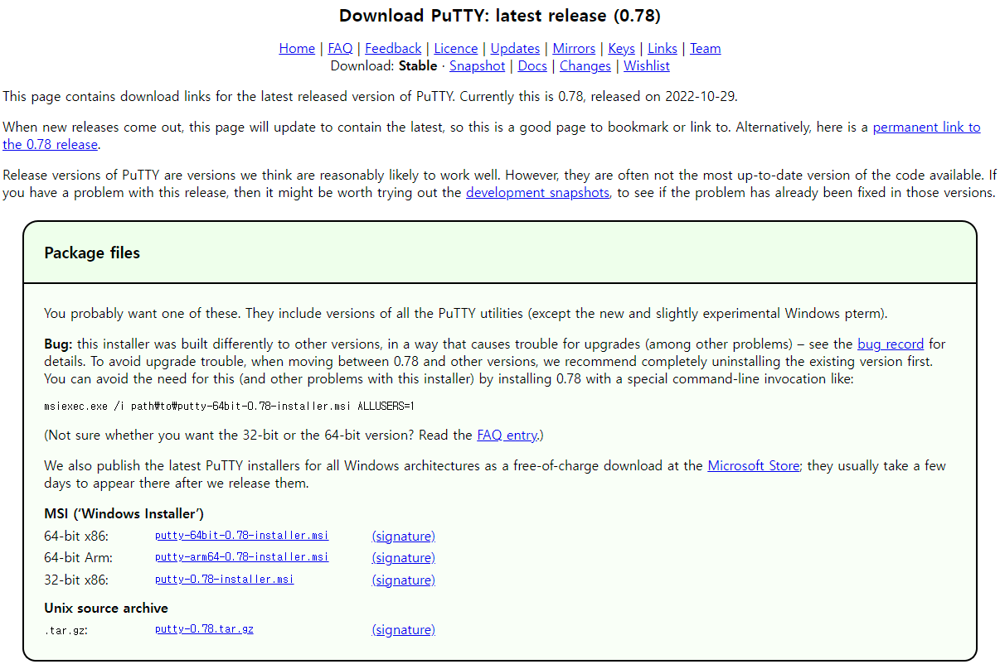
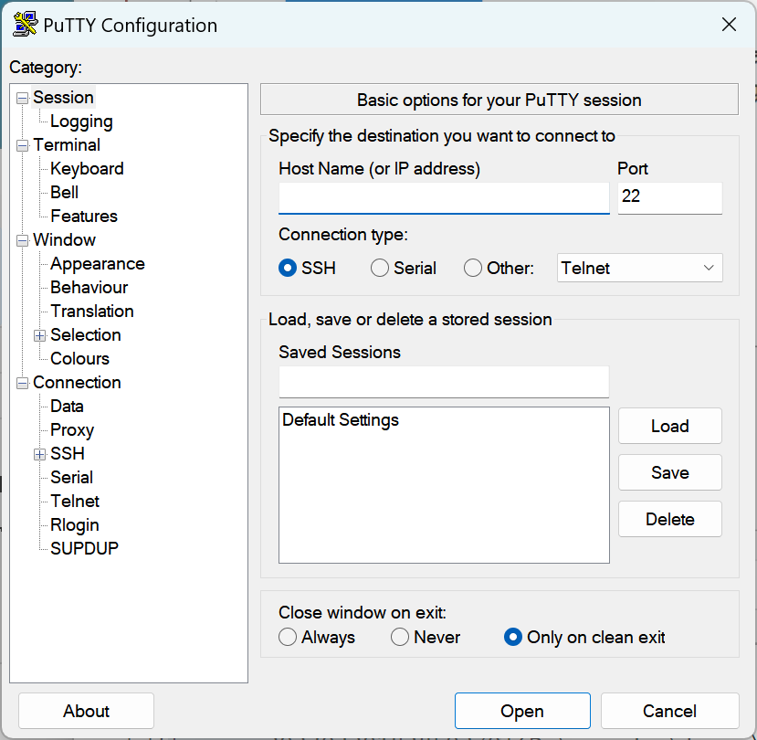
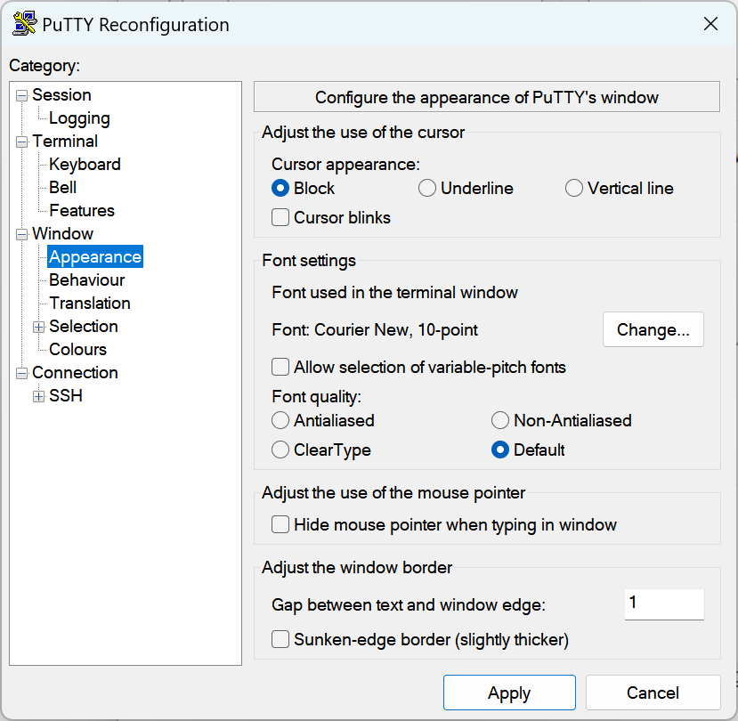

# putty 다운로드 및 설치
PuTTY는 SSH, 텔넷, rlogin, raw TCP를 위한 클라이언트로 동작하는 자유 및 오픈 소스 단말 에뮬레이터 응용 프로그램이다. PuTTY라는 이름에는 특별한 뜻이 없으나 tty는 유닉스 전통의 터미널의 이름을 가리키며 teletype를 짧게 줄인 것이다.

## 다운로드
putty는 무료로 사용할 수 있는 원격 클라이언트 도구 입니다.

클릭하여 https://www.putty.org/ 로 접속합니다. 바로 putty를 다운로드 받을 수 있도록 링크가 만들어져 있습니다.

## 설치하기

다운로드 받은 putty를 설치합니다.

## Putty  실행

설치한 putty를 실행합니다. 접속할 서버의 IP 주소를 입력후에 `open`을 선택합니다.

## 설정변경

### 글꼴크기 변경

`Window`->`Appearance`->`Font Setting`에서 `change` 버튼을 클릭합니다.

