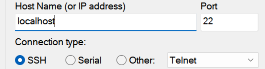

# SSH
telnet과 동일한 역할을 히는 프로그램으로 보안이 강화된 방식으로 접속하는 방법입니다.

## SSH란?
시큐어 셸은 네트워크 상의 다른 컴퓨터에 로그인하거나 원격 시스템에서 명령을 실행하고 다른 시스템으로 파일을 복사할 수 있도록 해 주는 응용 프로그램 또는 그 프로토콜을 가리킨다.
> 정리과제 : SSH란

  
## ssh 설치하기
> https://codechacha.com/ko/ubuntu-install-openssh/

ssh를 통하여 서버에 접속을 하기 위해서는 별도의 ssh 서비스 서버 프로그램을 설치해 주셔야 합니다.
ssh 서버를 구축하기 위해서는 2단계 작업이 필요 합니다.

* [방화벽 허용하기](setup)
* [ssh 패키지 설치하기](setup)
* [root로 접속 허용하기](setup)

### ssh 설치여부 확인하기
apt 명령으로 먼저 ssh가 설치가 되어 있는지 확인을 합니다.
```bash
s
hojin@hojin-VirtualBox:~$ apt list --installed | grep ssh

WARNING: apt does not have a stable CLI interface. Use with caution in scripts.

libssh-4/jammy,now 0.9.6-2build1 amd64 [installed,automatic]
openssh-client/jammy-updates,now 1:8.9p1-3ubuntu0.1 amd64 [installed,automatic]
openssh-server/jammy-updates,now 1:8.9p1-3ubuntu0.1 amd64 [installed,automatic]
openssh-sftp-server/jammy-updates,now 1:8.9p1-3ubuntu0.1 amd64 [installed,automatic]
ssh-import-id/jammy,jammy,now 5.11-0ubuntu1 all [installed,automatic]
ssh/jammy-updates,jammy-updates,now 1:8.9p1-3ubuntu0.1 all [installed]
hojin@hojin-VirtualBox:~$

```

### ssh 서버 설치
`apt` 명령어를 사용하여 패키지를 설치합니다.

```
$sudo apt-get install ssh
```

설치된 sshd가 실행중인지 확인을 합니다.
```bash
ps -ed | grep sshd
```

### VirtualBox 네트워크 추가 설정
외부에서 VirtualBox안에 있는 Ubuntu를 접속을 하기 위해서틑 포트 포워딩을 통한 활성화를 해주어야 합니다.
VirtualBox 메뉴에서 `장치`->`네크워크`->`네트워크 설정`을 선택합니다.


SSH는 기본적으로 22번 포트를 사용합니다. 윈도우 호스트의 22번 포트와 VM의 22번 포트를 연결해 주어야 합니다.

> 실제 서버를 사용하는 경우 보안을 위하여 다른 번호를 사용합니다.


## 클라이언트 접속
SSH 서버에 접속을 하기위해서는 전용 터미널 프로그램이 필요로 합니다. 

* [putty](terminal)
* [MobaXterm](terminal)

### Putty 다운로드 및 설치
가장 인기있는 SSH 서버 접속 프로그램은 `putty`입니다. `putty`는 매우 작고, 무료로 사용을 할 수 있습니다.
* [putty 설치하기](../putty)

### ssh 접속하기
putty를 실행합니다.


localhost로 접속을 합니다. 로컬 호스트의 22번 포트는 VM 의 22번 포트와 연결이 되어 있습니다. 




리눅스를 처음 설치할때 생성한 사용자 아이디로 로그인합니다.


클라이언트에서 서버로 원격으로 로그인을 진행합니다.


원격 접속을 종료할 때에는 `exit`명령을 입력합니다.


