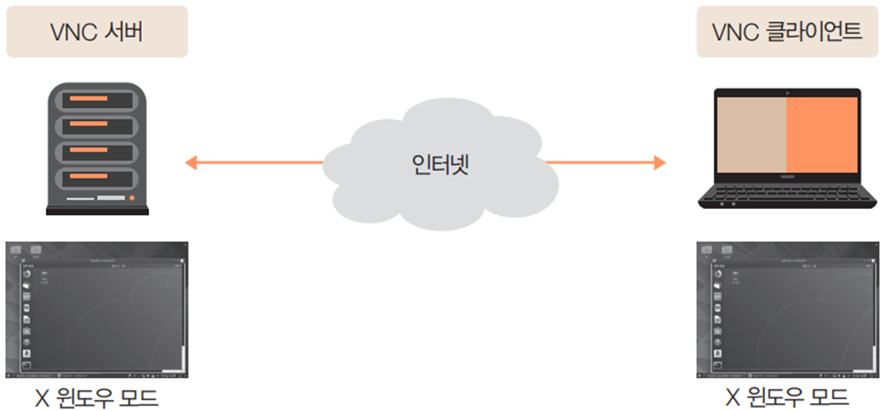
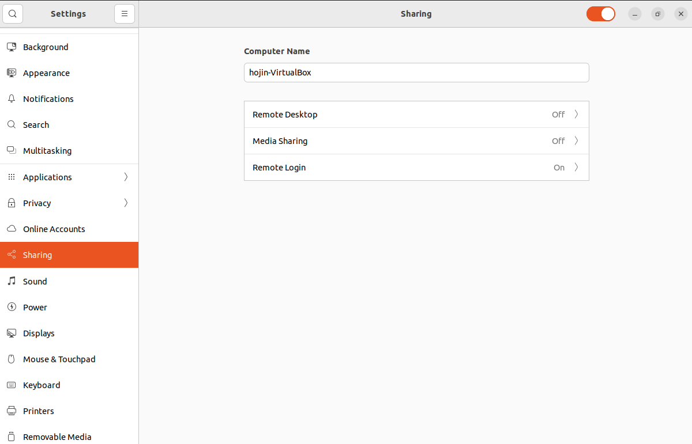
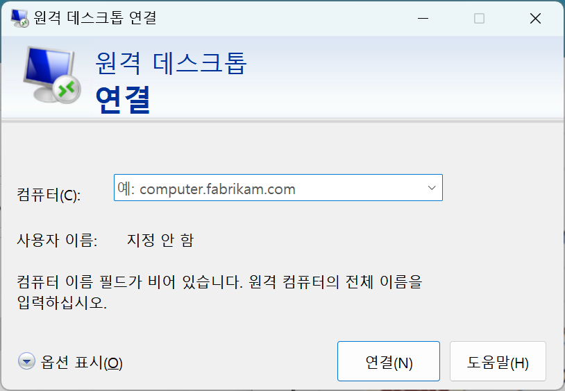
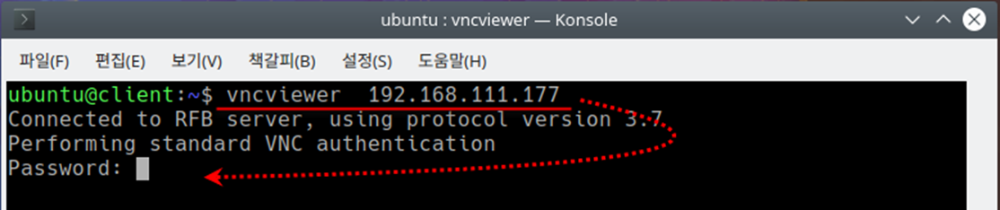
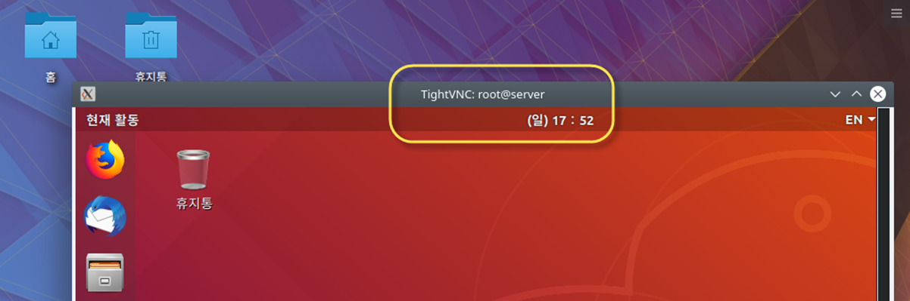

# VNC
VNC는 일반적인 터미널 모드와 달리 그래픽 모드로 서버를 원격 관리를 할 수 있습니다.


## VNC 서버

VNC를 이용하면 원격지에서 X 윈도우 환경을 사용할 수 있습니다.

* 그래픽 화면을 전송하는 원리

* 텍스트만 전송하는 텔넷과 비교하면 속도가 많이 느린 것이 단점





## VNC 서버 설치

VNC를 서버를 실행하기 위해서는 리눅스 운영체제를 데스크탑형으로 선택하여 x-window 를 같이 설치되어 있어야 합니다.


### 화면 공유 설정하기

화면 오른쪽 상단 아이콘을 클릭하여 `Setting`을 선택합니다.

* 설정텝에서 `Sharing`을 선택합니다.

* Sharing 항목을 `켬`으로 변경합니다.

  > 설정을 변경할때 암호를 물어보게 됩니다.





### Remote Desktop 활성화

`Remote Desktop`을 선택합니다. 세부 설정창이 실행되면 `켬`으로 변경합니다.


`remote Desktop`이 `on`상태로 변경되었습니다.


### 추가설치

```
sudo apt install dconf-editor
```


방화벽 열기, 5900 포트 허용

```
ufw allow 5900/tcp
```


Server의 IP 주소 확인

```
ifconfig
```


## Client에서 Server에 접속하기
VNC 서버에 접속을 하기 위해서는 전용 클라이언트 프로그램이 필요로 합니다.

* [Tightvnc](tightvnc) 클라이언트 설치
* 윈도우 원격 데스크탑 연결

### VNC 클라이언트 실행

#### windows용 Tightvnc 실행


서버주소를 입력합니다.

#### 원격데스크탑연결


#### 리눅스용

vncviewer 서버IP주소 명령을 입력하여 Server에 접속

VNC 서버 전용 비밀번호인 입력




## 접속확인
X 윈도우 환경에 접속됨, [현재 활동]을 통해 필요한 프로그램 실행 가능




