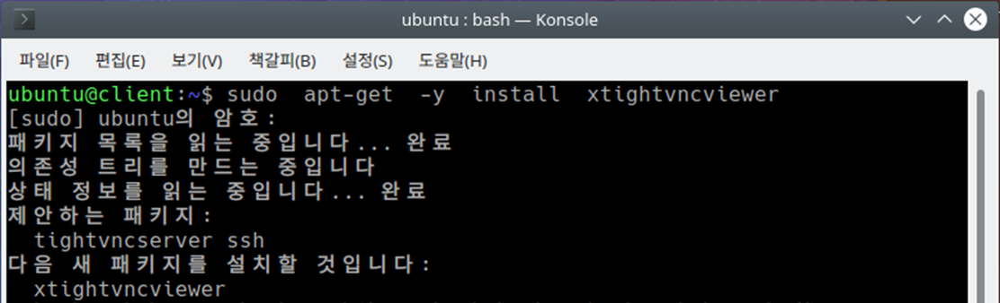
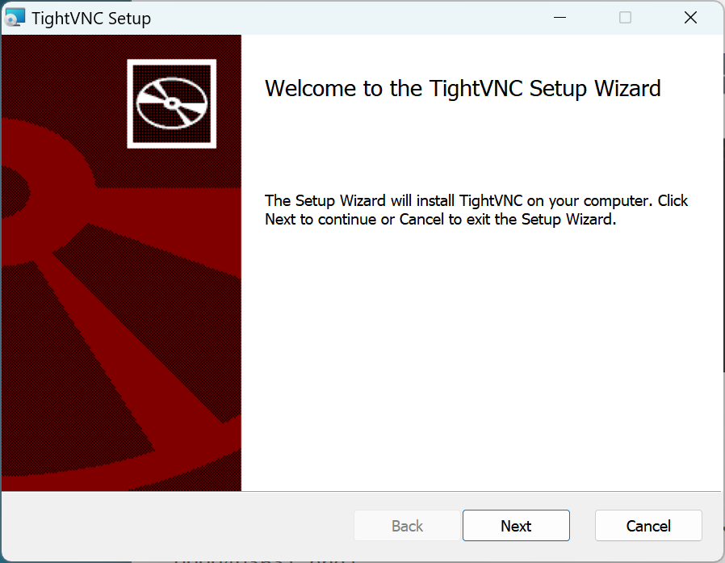
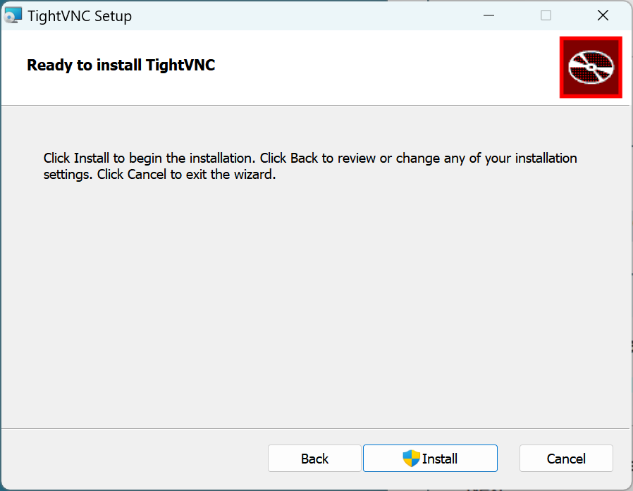
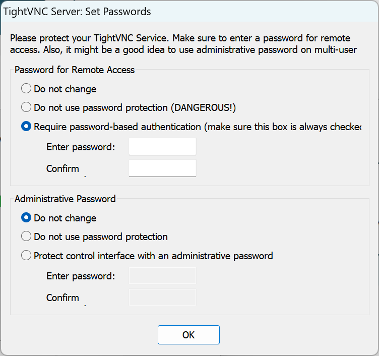

# Tightvnc Viewer


TightVNC 클라이언트를 설치합니다. 사이트 주소는 다음과 같습니다. https://www.tightvnc.com/download.php


#### 리눅스용

Client에 VNC 클라이언트 프로그램 설치합니다.

```
sudo apt inatall xtightvncviewer
```





#### windows용











