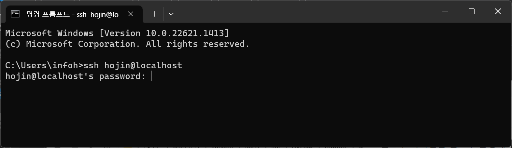

# 윈도우 터미널

## 윈도우 터미널이란?
윈도우 터미널은 윈도우 운영체제에 설치되어 있는 기본 콘솔 툴 입니다.  


## ssh 접속
윈도우 터미널에서 원격 서버로 ssh 접속을 할때 `ssh` 명령을 사용할 수 있습니다.
```
ssh 주소
```

주소만 입력하는 경우 윈도우의 사용자 아이디와 동일한 계정으로 접속됩니다.


만일 다른 사용자 아디디로 접속을 할려고 한다면 주소 앞에 아이디를 입력합니다.

```
ssh 아이디@주소
```




정상적으로 로그인이 되는 것을 확인할 수 있습니다.

