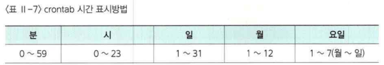
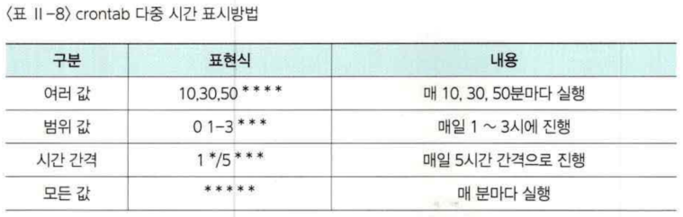

# Crontab
crontab은 서버 내 특정 프로세스를 주기적으로 실행시키고자 할 때 해당 프로세스와실행 스케줄을 지정하고 실행시키는 데몬이다.
> https://jdm.kr/blog/2


## 편집명령

```bash
contab -e
```

vi  편집기가 실행됩니다.


## 설정 문장

[분, 시, 일, 월 요일, 실행명령(전체경로)］의 순서로 한 칸씩 띄어서 표시








## 확인

`cronttab -l` 명령으로 crontab의 명령이 등록되어 있움을 확인


## 삭제

`cronttab - r` 명령으로 crontab의 명령 등록을삭제함


