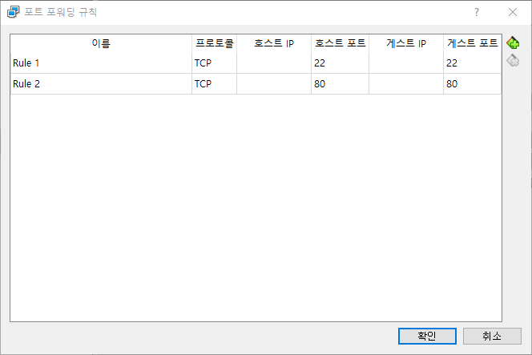

# Nginx 설치(APT)
`apt`명령을 통하여 Nginx를 설치합니다.

## 준비사항
설치하기 전에 패키지 목록을 갱신합니다.

```bash
sudo apt update
```

apt 패키지 매니저를 사용하여 아파치2를 설치할 수 있는지 여부를 확인하려면 다음 명령어를 사용하십시오:

```bash
apt-cache search nginx
```


## 패키지 설치
Ubuntu나 Debian 등의 Debian 계열 리눅스에서는 아래의 명령어를 사용하여 Nginx를 설치할 수 있습니다.  

```bash
sudo apt install nginx
```

또는 다음과 같이 명령을 입력할 수도 있습니다.

```bash
sudo apt install nginx -y
```

위 명령어를 실행하면 최신 버전의 Nginx가 자동으로 설치됩니다. 설치 후에는 아래와 같은 명령어로 Nginx의 버전을 확인할 수 있습니다.

```bash
nginx -v
```

실행결과 및 예시
```bash
test@test:~$ sudo nginx -v
nginx version: nginx/1.18.0 (Ubuntu)
```

## 엔진엑스 시작
nginx 시작은 다음과 같은 명령으로 사용가능합니다.

```bash
$ sudo service nginx start
$ sudo systemctl start nginx
$ sudo /etc/init.d/nginx start
```

nginx를 데몬을 실행한 후에 `localhost`로 접속을 합니다.
> 만일 가상머신을 사용하는 경우에는 80포트를 포워딩 해주어야 합니다.

### 엔진엑스 종료하기

```bash
$ sudo service nginx stop
$ sudo systemctl stop nginx
$ sudo /etc/init.d/nginx stop
```

### 엔진엑스 재시작

```bash
$ sudo service nginx restart
$ sudo systemctl restart nginx
$ sudo /etc/init.d/nginx restart
```

### 엔진엑스 상태확인

```bash
// 상태
$ sudo service nginx status
$ sudo systemctl status nginx
```


### 엔진엑스 reload
```bash
// 설정 reload
$ sudo service nginx reload
$ sudo systemctl reload nginx
$ sudo nginx -s reload
```


## 브라우저 접속 및 확인

호스트 컴퓨터에서 브라우저를 이용하여 접속합니다.  


만일 포트 번호를 다른번호로 변경한 경우 localhost:포트번호 형태로 입력합니다.


### 포트 포워딩

VirtualBox와 같은 환경을 사용할때 포트 포워딩을 추가합니다.




