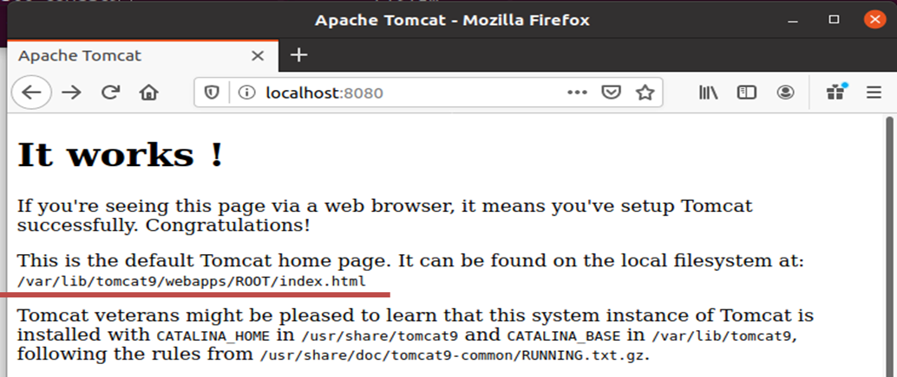
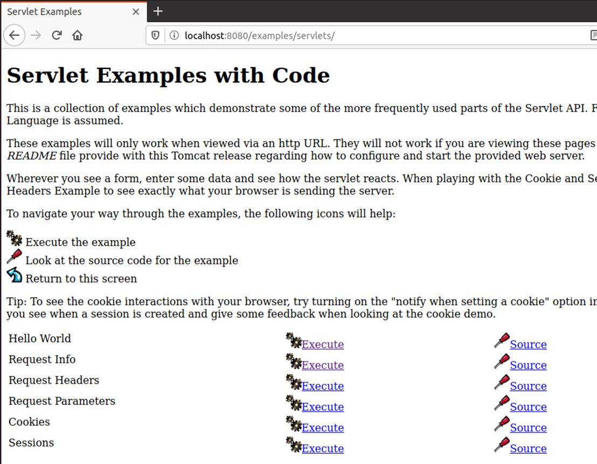
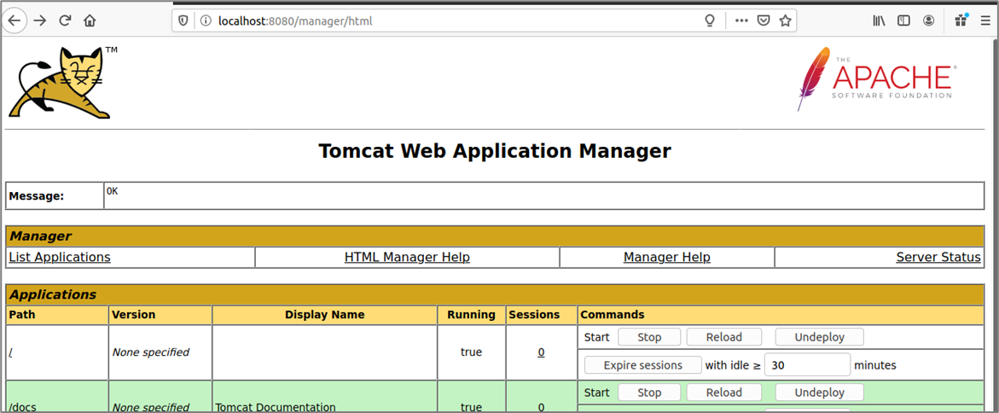

# Tomcat9
이 릴리스에서는 Java Servlet API 4.0 및 JSP 2.3에 대한 지원이 도입되었습니다. 또한 HTTP/2 및 JAAS(Java Authentication and Authorization Service)에 대한 지원도 포함되었습니다.

## 준비사항
톰켓 was를 사용하기 위해서는 먼저 [java](/dev/java)가 설치되어 있어야 합니다.

먼저 시스템의 패키지 인덱스를 업데이트하고 다음 명령을 실행하여 설치된 모든 패키지가 최신인지 확인합니다.

```bash
sudo apt update
```

설치 가능한 `tomcat` 패키지 목록이 있는지 확인합니다.

```bash
sudo apt-cache search tomcat
```


## 톰켓 설치
패키지명 뒤에 `*`를 이용하여 `tomcat9`으로 시작되는 모든 패키지들을 한번에 설치 할 수 있습니다.

```bash
sudo apt install tomcat9* -y
```

명령 실행 및 결과 확인
```bash
hojin@hojin3:~$ sudo apt install tomcat9*
Reading package lists... Done
Building dependency tree... Done
Reading state information... Done
Note, selecting 'tomcat9-admin' for glob 'tomcat9*'
Note, selecting 'tomcat9' for glob 'tomcat9*'
Note, selecting 'tomcat9-examples' for glob 'tomcat9*'
Note, selecting 'tomcat9-common' for glob 'tomcat9*'
Note, selecting 'tomcat9-docs' for glob 'tomcat9*'
Note, selecting 'tomcat9-user' for glob 'tomcat9*'
The following additional packages will be installed:
중간생략...
```

실습에서 보는 것처럼 6개의 패키지가 설치되는 것을 볼 수 있습니다.
* tomcat9-admin
* tomcat9
* tomcat9-examples
* tomcat9-common
* tomcat9-docs
* tomcat9-user

## 접속포트 허용
톰켓은 기본적으로 8080 포트를 사용합니다. 만일, 이 포트를 계속 사용하려면 방화벽에서 포트를 허용합니다.

```bash
hojin@hojin3:~$ sudo ufw allow 8080/tcp
Rules updated
Rules updated (v6)
```

## 데몬실행
톰켓 데몬을 실행합니다.

### service 명령 사용
서비스 명령을 통하여 톰켓을 실행합니다.

```bash
sudo service tomcat9start
```
> 명령이 인식이 안되는 경우 systemctl을 활성화 한후에, 다시 실행합니다.

정지
```bash
sudo service tomcat stop
```


상태확인
```bash
hojin@hojin3:~$ sudo service tomcat9 status
● tomcat9.service - Apache Tomcat 9 Web Application Server
     Loaded: loaded (/lib/systemd/system/tomcat9.service; enabled; vendor preset: enabled)
     Active: active (running) since Sun 2023-04-02 18:18:49 KST; 57s ago
       Docs: https://tomcat.apache.org/tomcat-9.0-doc/index.html
    Process: 1143 ExecStartPre=/usr/libexec/tomcat9/tomcat-update-policy.sh (code=exited, status=0/SUCCES>
   Main PID: 1147 (java)
      Tasks: 41 (limit: 18923)
     Memory: 391.8M
        CPU: 11.308s
     CGroup: /system.slice/tomcat9.service
             └─1147 /usr/lib/jvm/default-java/bin/java -Djava.util.logging.config.file=/var/lib/tomcat9/c>

Apr 02 18:18:51 hojin3 tomcat9[1147]: Deployment of deployment descriptor [/etc/tomcat9/Catalina/localhos>
Apr 02 18:18:51 hojin3 tomcat9[1147]: Deploying deployment descriptor [/etc/tomcat9/Catalina/localhost/do>
Apr 02 18:18:51 hojin3 tomcat9[1147]: The path attribute with value [/docs] in deployment descriptor [/et>
Apr 02 18:18:51 hojin3 tomcat9[1147]: At least one JAR was scanned for TLDs yet contained no TLDs. Enable>
Apr 02 18:18:51 hojin3 tomcat9[1147]: Deployment of deployment descriptor [/etc/tomcat9/Catalina/localhos>
Apr 02 18:18:51 hojin3 tomcat9[1147]: Deploying web application directory [/var/lib/tomcat9/webapps/ROOT]
Apr 02 18:18:51 hojin3 tomcat9[1147]: At least one JAR was scanned for TLDs yet contained no TLDs. Enable>
Apr 02 18:18:51 hojin3 tomcat9[1147]: Deployment of web application directory [/var/lib/tomcat9/webapps/R>
Apr 02 18:18:51 hojin3 tomcat9[1147]: Starting ProtocolHandler ["http-nio-8080"]
Apr 02 18:18:51 hojin3 tomcat9[1147]: Server startup in [1982] milliseconds
```

### 수동실행
먼저 로그가 저장될 폴더를 생성한 후에, 스크립트를 이용하여 톰켓을 실행합니다.

```bash
sudo mkdir /usr/share/tomcat9/logs
sudo /usr/share/tomcat9/bin/startup.sh
```

## 접속 확인

설치 확인

[http://localhost:8080](http://localhost:8080/) (8080은 tomcat에서 정한 port)




* tomcat 기본 경로 - /var/lib/tomcat9/webapps/ROOT

* 경로 변경 - /etc/tomcat9/server.xml

Example을 확인해 보자




## Tomcat-admin – GUI 관리도구

* Tomcat에 app을 deploy, 설정 변경
* 주소: Localhost:8080/manager

### manager 페이지를 사용하기 위한 권한 부여 
tomcat9-admin에 접속을 하기 위해서는 사용자 아이디와 패스워드 설정이 필요합니다.

```bash
sudo vi /etc/tomcat9/tomcat-users.xml
```
다음과 같이 `아이디`와 `패스워드`를 넣어줍니다.

```xml
<tomcat-users>
    중간생략....
    <role rolename="admin-gui"/>
    <user username="tomcat" password="123456" roles="admin-gui"/>
</tomcat-users>
```

