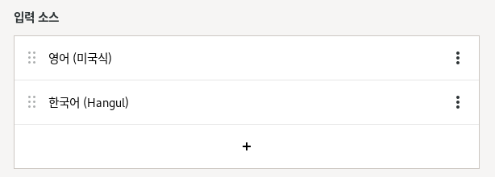

# 설정

## 업데이트 비활성화
```
gsettings set org.gnome.software download-updates false
```

```
systemctl disable dnf-makecache.service
systemctl disable dnf-makecache.timer
```


## 키보드 설정

한글과 영문이 모두 작성이 가능하도록 환경설정에서 키보드 설정을 합니다.

기존의 키보드 입력을 삭제하시고, 다음과 같이 2개의 키보드를 선택합니다.



> 한영전환은 `shift`+`space`키를 누르면 한/영이 변환됩니다.

